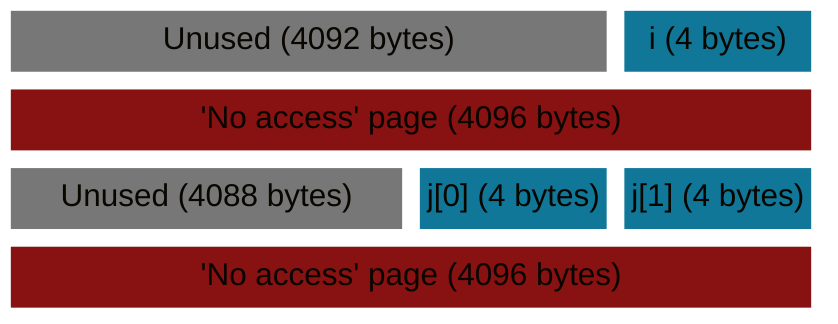

<script src="{{ '/assets/js/no_scroll_on_expand.js' | relative_url }}"></script>

## Introduction

I am currently in the process of converting my codebase to mostly use memory arenas for its allocations and will see where it leads me.
<br/>This blog post is here to gather my thoughts and ideas I had along the way to serve as future reference for me; and hopefully be helpful to others!

This blog [post](https://www.rfleury.com/p/untangling-lifetimes-the-arena-allocator) by Ryan Fleury challenged a lot what I previously learned and quite deeply changed the way I see allocations in a program now.
<br/>Allocations did matter to me before: I tried to hook every allocations in order to track leaks, to gather statistics and to reduce them as much as possible. I could also detect some used-after-free and some kinds of buffer overruns.
However, they were still done the "standard" way: a pair of `malloc`/`free` or `new`/`delete`.

I will not repeat everything that Ryan explains thoroughly in his blog, so go read [it](https://www.rfleury.com/p/untangling-lifetimes-the-arena-allocator) if you haven't yet!
<br/>I also highly recommand the [various](https://nullprogram.com/blog/2023/09/27/) [blog](https://nullprogram.com/blog/2023/09/30/) [posts](https://nullprogram.com/blog/2023/10/05/) of Chris Wellons that were also a source of inspiration for me!


### Some context
The codebase I mentionned is my hobby pathtracer written in C++ and CUDA.
<br/>I am trying to see how using C++ features could "ease" the usage of memory arenas and what obstacles I would meet along the way.
<br/>I am not really a big fan of all of what "modern" C++ has to offer so I tend to cherry pick the new features when I find them worthwhile. I also avoid the STL and use the more performance-oriented [EASTL](https://github.com/electronicarts/EASTL) (even though I might phase it out at some point).


## Key concepts

A memory arena holds **allocations** with the **same lifetime**. Once the end of the lifetime is reached, **all allocations** are released at **once**.

I think it is important to differentiate the **memory arena** from the **allocation schemes**.
<br/>The **memory arena** provides the **backing memory storage**, while the **allocation schemes** dictates **how** the memory is retrieved from (and eventually released to) the arena.
<br/>Allocation schemes are handled by allocators layered on top of a arena. All kind of allocators can be implemented, just naming a few: linear, block, pool, tlsf, etc.

This separation is here to keep the memory arena interface simple and to handle **sub-lifetimes** and **transient** memory more efficiently.


## Memory arena types

At first I tried to find some key properties to help me classify memory arena types.
I came up with 4 base types:
  * `FixedMemoryArena`: which represents a **fixed-size**, **contiguous** and **stable** memory range
  * `DynamicMemoryArena`: which represents a **growable**, **contiguous** but (potentially) **unstable** memory range
  * `BlockMemoryArena`: which represents a **growable** set of **contiguous** and **stable** memory range**s**
  * `VirtualMemoryArena`: which represents a **growable**[^fn-vmem_growable], **contiguous** and **stable** memory range

  [^fn-vmem_growable]: within a predefined limit (the reserve)

From which we can extract 3 key properties: **contiguous**, **growable** and **stable**:

| Type               | Contiguous | Growable | Stable |
| :----------------- | :--------: | :------: | :----: | 
| FixedMemoryArena   | true       | false    | true   | 
| DynamicMemoryArena | true       | true     | false  | 
| BlockMemoryArena   | false      | true     | true   | 
| VirtualMemoryArena | true       | true     | true   |

However, after some experimentations, I found out that having a memory arena with a non-stable memory range adds a lot of complexity on the user side because of invalidation of existing allocations upon growing. Moreover, allowing non-contiguous memory range also adds complexity on its own and makes it more difficult to compose with different allocation schemes.
So I quickly dropped the unstable `DynamicMemoryArena` and the non-contiguous `BlockMemoryArena`.

So in this end, I kept only **2 base memory arena types** that are both **contiguous** and **stable**: the `FixedMemoryArena` and the `VirtualMemoryArena`; that only differ on their capacity to grow.

| Type               | Growable |
| :----------------- | :------: | 
| FixedMemoryArena   | false    | 
| VirtualMemoryArena | true     |

The allocators can provide the **growable** property over a `FixedMemoryArena` memory sub-range if needed.


### Interface

This resulted in the following interface:


```cpp
enum class MemoryArenaFlag : U32
{
	NONE,
	ZERO_MEMORY = 1u << 0,
	NO_OVERFLOW = 1u << 1
};
K_DECLARE_INLINE_ENUM_FLAG_OPERATORS(MemoryArenaFlag)

class MemoryArena
{
	public:
   		// 16 bytes like malloc (https://stackoverflow.com/questions/70692795/why-is-malloc-16-byte-aligned)
		static constexpr ptrdiff_t DefaultAlignment = 16;

	public:
		virtual void * allocate(ptrdiff_t byteSize, ptrdiff_t alignment = DefaultAlignment, MemoryArenaFlag flags = MemoryArenaFlag::NONE) = 0;

		virtual void * beg() const = 0;
		virtual void * ptr() const = 0;
		virtual void * end() const = 0;

		virtual bool rewind(void * mark) = 0;
		virtual void reset() = 0;
		virtual void free() = 0;

		virtual bool growable() const = 0;

    // Helpers
    // ...
};
```

* `allocate`: Allocate some number of bytes with the given alignment from the arena. Return nullptr on failure.
* `beg`: Return a pointer to the beginning of the arena address range.
* `ptr`: Return a pointer to the current position within the arena address range.
* `end`: Return a pointer to the end of the arena address range.
* `rewind`: Try to rewind the arena current position to the given pointer.
* `reset`: Reset the current position to the beginning of the arena.
* `free`: Free the backing memory of the arena.
* `growable`: Tells whether the arena backing memory range can grow (while staying contiguous and stable).


<br/>I also added some helper methods based on the interface:

```cpp
class MemoryArena
{
    // ...

	template <typename T>
	inline bool allocateElements(Span<T> & oSpan, ptrdiff_t numElements, MemoryArenaFlag flags = MemoryArenaFlag::NONE)
	{
		static_assert(
			Traits::IsTriviallyConstructible<T>::Value || Traits::IsDefaultConstructible<T>::Value,
			"T must be trivially or default constructible to be used with a MemoryArena"
		);
		static_assert(
			Traits::IsTriviallyDestructible<T>::Value,
			"T must be trivially destructible to be used with a MemoryArena"
		);

		if(void * ptr = allocate(numElements * sizeof(T), alignof(T), flags))
		{
			oSpan.data = static_cast<T*>(ptr);
			oSpan.length = numElements;

			if constexpr(!Traits::IsTriviallyConstructible<T>::Value)
			{
				for(ptrdiff_t i = 0; i < numElements; ++i)
					new(&oSpan.data[i]) T{};
			}

			return true;
		}
		return false;
	}

	template <typename T>
	inline Span<T> allocateElements(ptrdiff_t numElements, MemoryArenaFlag flags = MemoryArenaFlag::NONE)
	{
		Span<T> span;
		allocateElements(span, numElements, flags);
		return span;
	}

	template <typename T>
	inline bool allocateElements(T *& oPtr, ptrdiff_t numElements, MemoryArenaFlag flags = MemoryArenaFlag::NONE)
	{
		Span<T> span;
		if(allocateElements(span, numElements, flags))
		{
			oPtr = span.data;
			return true;
		}
		return false;
	}

	template <typename T>
	inline T * allocateElement(MemoryArenaFlag flags = MemoryArenaFlag::NONE)
	{
		return allocateElements<T>(1, flags).data;
	}

	inline ptrdiff_t getAvailableByteSize() const
	{
		return PtrUtils::Diff(end(), ptr());
	}

	inline ptrdiff_t getTotalByteSize() const
	{
		return PtrUtils::Diff(end(), beg());
	}
};
```

Some may argue that the interface I suggest is not really minimalist, and indeed there are examples in Chris' [blogs](https://nullprogram.com/blog/2023/09/27/) that are way more succinct.
<br/>However I feel struck a good balance between ease of usage and functionality, but YMMV.


### FixedMemoryArena

The `FixedMemoryArena` class represents non-growable memory arena.

```cpp
class FixedMemoryArena : public MemoryArena
{
	void * m_beg = nullptr;
	void * m_end = nullptr;
	void * m_ptr = nullptr;

	public:
		bool init(ptrdiff_t byteSize)
		{
			free();

			if(m_beg = K_MALLOC_ALIGNED(byteSize, DefaultAlignment))
			{
				m_end = PtrUtils::Add(m_beg, byteSize);
				m_ptr = m_beg;
				return true;
			}
			return false;
		}

		void * allocate(ptrdiff_t byteSize, ptrdiff_t alignment = DefaultAlignment, MemoryArenaFlag flags = MemoryArenaFlag::NONE) override
		{
			if(!m_beg)
				return nullptr;

			if(byteSize <= 0 || alignment == 0)
				return nullptr;

			void * allocBeg = PtrUtils::AlignForward(m_ptr, alignment);
			void * allocEnd = PtrUtils::Add(allocBeg, byteSize);

			if(allocEnd <= m_end)
			{
				m_ptr = allocEnd;
				if(flags & MemoryArenaFlag::ZERO_MEMORY)
					Memset(allocBeg, 0, byteSize);
				return allocBeg;
			}

			return nullptr; // Out of memory
		}

		void * beg() const override
		{
			return m_beg;
		}

		void * ptr() const override
		{
			return m_ptr;
		}

		void * end() const override
		{
			return m_end;
		}

		bool rewind(void * mark) override
		{
			if(K_ASSERT_CONDITION(mark >= m_beg && mark <= m_ptr))
			{
				m_ptr = mark;
				return true;
			}
			return false;
		}

		void reset() override
		{
			m_ptr = m_beg;
		}

		void free() override
		{
			if(m_beg)
			{
				K_FREE_ALIGNED(m_beg);
				m_beg = nullptr;
				m_end = nullptr;
				m_ptr = nullptr;
			}
		}

		bool growable() const override
		{
			return false;
		}
};
```

Note: the macro `K_ASSERT_CONDITION` asserts in debug build and is just replaced by the condition in release.


### VirtualMemoryArena

The `VirtualMemoryArena` class represents growable memory arena backed with virtual memory.
<br/>It works by first allocating a (usually huge) contiguous virtual memory address range and then commit pages as needed.

> On 64-bit 80x86 CPUs a virtual address in 64 bits, with only the lowest 48 bits supported by the MMU, resulting in a effective address space of 256TiB[^fn-vmem_address_space].

[^fn-vmem_address_space]: <https://stackoverflow.com/questions/72411992/whats-the-maximum-size-of-virtual-memory>

Thus we can easily allocate a few `VirtualMemoryArena` of several gigabytes if needed.

#### Page-protected VirtualMemoryArena

One nice thing with virtual memory is that you can control page access and this can be used to provide a debug `VirtualMemoryArena` with
some protections to detect **buffer overruns** and **incorrect usages of memory after a `rewind` or a `free`**.


##### Buffer overrun detection

To detect **buffer overruns**, we place each allocation in its own set of pages and add a **"no access" page** just after:
<br/>The allocation is placed such that the end of the allocation range matches the end of a page (or is at least very close; since it is not always possible to exactly match a page end due to alignment constraints).
<br/>Then whenever the memory after the allocation is accessed (buffer overrun), it goes through the "no access" page we added; triggering an **access violation**.

**Write access violation example**:


The memory looks something like that (with addresses increasing from left to right, top to bottom, assuming 4k pages):



So when we try to access `i+1` we end up in a protected "no access" page.

<br/>
> While this approach is simple it wastes a lot of memory for small allocations since there are done at the page size granularity (usually 4096 bytes)!
{: .prompt-warning }

<br/>
**Read access violation example**:


<br/>
##### Use-after-rewind/reset detection

To detect the **use-after-rewind/reset** cases, once `rewind` or `reset` (which is equivalent to rewinding to the beginning of the arena) are called, the pages from the one containing the rewind mark to the end of the arena are marked as "no access".

**Invalid use-after-rewind example**:


> Rewinding cannot happen at an arbitrary position within the allocation but is aligned to the *previous* multiple of page size (since protection happens at page-granularity)!
{: .prompt-warning }

<br/>
**Invalid use-after-reset example**:


Below you can find most the code of the `VirtualMemoryArena` (Windows only):

<details>
	<summary>Click to expand</summary>



// Enable/disable page-protected virtual memory arena:
//   - place each allocation in its own set of pages and add a "no access" page just after to detect out-of-bound accesses.
//   - set "no access" protection on pages after a rewind() or a reset() to detect use-after-free usages.
#define K_VIRTUAL_MEMORY_ARENA_DEBUG_PAGE_PROTECTION 1
#define K_VIRTUAL_MEMORY_ARENA_DEBUG_PAGE_PROTECTION_GUARD_PATTERN   0xAA
#define K_VIRTUAL_MEMORY_ARENA_DEBUG_PAGE_PROTECTION_REWIND_PATTERN  0xBB
#define K_VIRTUAL_MEMORY_ARENA_DEBUG_PAGE_PROTECTION_RESET_PATTERN   0xCC
#define K_VIRTUAL_MEMORY_ARENA_DEBUG_PAGE_PROTECTION_PADDING_PATTERN 0xDD

#define K_VIRTUAL_MEMORY_ARENA_DEBUG_ENABLE_LOGGING 0

#if K_VIRTUAL_MEMORY_ARENA_DEBUG_ENABLE_LOGGING
#define K_VIRTUAL_MEMORY_ARENA_DEBUG_LOG(...) K_CH_INFO(VirtualMemoryArena, __VA_ARGS__)
#else
#define K_VIRTUAL_MEMORY_ARENA_DEBUG_LOG(...)
#endif

struct VirtualMemoryBlock
{
	void * beg = nullptr;
	void * end = nullptr;
};

// Get the granularity at which virtual memory can be reserved
uintptr_t GetVirtualMemoryAllocationGranularity()
{
	#ifdef K_PLATFORM_WINDOWS
	SYSTEM_INFO systemInfo;
	GetSystemInfo(&systemInfo);
	return systemInfo.dwAllocationGranularity;
	#else
	static_assert(false, "GetVirtualMemoryAllocationGranularity: not implemented");
	#endif
}

// Get the granularity at which virtual memory can be committed
uintptr_t GetVirtualMemoryCommitGranularity()
{
	#ifdef K_PLATFORM_WINDOWS
	SYSTEM_INFO systemInfo;
	GetSystemInfo(&systemInfo);
	return systemInfo.dwPageSize;
	#else
	static_assert(false, "GetVirtualMemoryCommitGranularity: not implemented");
	#endif
}

uintptr_t GetVirtualMemoryPageSize()
{
	#ifdef K_PLATFORM_WINDOWS
	SYSTEM_INFO systemInfo;
	GetSystemInfo(&systemInfo);
	return systemInfo.dwPageSize;
	#else
	static_assert(false, "GetVirtualMemoryPageSize: not implemented");
	#endif
}

// Reserve virtual memory rounded up to the allocation granularity
VirtualMemoryBlock VirtualMemoryReserve(ptrdiff_t byteSize, uintptr_t allocationGranularity)
{
	#ifdef K_PLATFORM_WINDOWS
	VirtualMemoryBlock block;

	byteSize = PtrUtils::AlignForward(byteSize, allocationGranularity);
	if(void * ptr = VirtualAlloc(nullptr, byteSize, MEM_RESERVE, PAGE_NOACCESS))
	{
		block.beg = ptr;
		block.end = PtrUtils::Add(block.beg, byteSize);
	}

	return block;
	#else
	static_assert(false, "VirtualMemoryReserve: not implemented");
	#endif
}

// Commit a range of reserved virtual memory
VirtualMemoryBlock VirtualMemoryCommit(VirtualMemoryBlock const & block, uintptr_t commitGranularity)
{
	#ifdef K_PLATFORM_WINDOWS
	VirtualMemoryBlock committedBlock;
	committedBlock.beg = PtrUtils::AlignBackward(block.beg, commitGranularity);
	committedBlock.end = PtrUtils::AlignForward(block.end,  commitGranularity);

	const uintptr_t committedBlockByteSize = (uintptr_t)committedBlock.end - (uintptr_t)committedBlock.beg;
	if(VirtualAlloc(committedBlock.beg, committedBlockByteSize, MEM_COMMIT, PAGE_READWRITE))
	{
		return committedBlock;
	}

	return { nullptr, nullptr };
	#else
	static_assert(false, "VirtualMemoryCommit: not implemented");
	#endif
}

// https://learn.microsoft.com/en-us/windows/win32/api/memoryapi/nf-memoryapi-virtualprotect
bool VirtualMemorySetReadWriteAccess(VirtualMemoryBlock const & block)
{
	const ptrdiff_t size = PtrUtils::Diff(block.end, block.beg);
	DWORD oldProtection = 0;
	return VirtualProtect(block.beg, size, PAGE_READWRITE, &oldProtection);
}

// https://learn.microsoft.com/en-us/windows/win32/api/memoryapi/nf-memoryapi-virtualprotect
bool VirtualMemorySetNoAccess(VirtualMemoryBlock const & block)
{
	const ptrdiff_t size = PtrUtils::Diff(block.end, block.beg);
	DWORD oldProtection = 0;
	return VirtualProtect(block.beg, size, PAGE_NOACCESS, &oldProtection);
}

class VirtualMemoryArena : public MemoryArena
{
	VirtualMemoryBlock m_vmem;
	void * m_endCommitted;
	void * m_ptr;
	ptrdiff_t m_reserveByteSize;
	ptrdiff_t m_minCommitByteSize; // Used to avoid performing too many allocations

	uintptr_t m_allocationGranularity;
	uintptr_t m_commitGranularity;
	
	#if K_VIRTUAL_MEMORY_ARENA_DEBUG_PAGE_PROTECTION
	uintptr_t m_pageSize;
	size_t m_numAllocs;
	#endif

	char m_name[64];

	public:
		static constexpr ptrdiff_t DefaultMinCommitByteSize = 256 * 1024;

		VirtualMemoryArena(char const * name = "VirtualMemoryArena"):
			MemoryArena(),
			m_vmem(),
			m_endCommitted(nullptr),
			m_ptr(nullptr),
			m_reserveByteSize(0),
			m_minCommitByteSize(0),
			m_allocationGranularity(0),
			m_commitGranularity(0)
			#if K_VIRTUAL_MEMORY_ARENA_DEBUG_PAGE_PROTECTION
			, m_pageSize(0)
			, m_numAllocs(0)
			#endif
		{
			Strncpy(m_name, name, sizeof(m_name));
		}

		void init(ptrdiff_t reserveByteSize, ptrdiff_t minCommitByteSize = DefaultMinCommitByteSize)
		{
			if(!m_vmem.beg)
			{
				m_allocationGranularity = GetVirtualMemoryAllocationGranularity();
				m_commitGranularity = GetVirtualMemoryCommitGranularity();

				#if K_VIRTUAL_MEMORY_ARENA_DEBUG_PAGE_PROTECTION
				m_pageSize = GetVirtualMemoryPageSize();
				#endif

				m_vmem = VirtualMemoryReserve(reserveByteSize, m_allocationGranularity);
				m_endCommitted = m_vmem.beg;
				m_ptr = m_vmem.beg;
				m_reserveByteSize = PtrUtils::Diff(m_vmem.end, m_vmem.beg);
				m_minCommitByteSize = minCommitByteSize;
			}
		}

		#if K_VIRTUAL_MEMORY_ARENA_DEBUG_PAGE_PROTECTION
		void * allocate(ptrdiff_t byteSize, ptrdiff_t alignment = DefaultAlignment, MemoryArenaFlag flags = MemoryArenaFlag::NONE) override
		{
			if(!m_vmem.beg)
				return nullptr;

			if(byteSize == 0)
				return nullptr;

			// Each alloc has its own set of pages
			ptrdiff_t allocByteSize = byteSize;
			allocByteSize = ((allocByteSize + m_pageSize - 1) / m_pageSize) * m_pageSize; // Round to next multiple of page size
			allocByteSize += m_pageSize; // Add an extra page after the allocation space to detect out of bound accesses

			K_ASSERT(m_endCommitted);
			K_ASSERT(PtrUtils::IsAligned(m_endCommitted, m_pageSize));

			VirtualMemoryBlock candidateCommitBlock;
			candidateCommitBlock.beg = m_endCommitted;
			candidateCommitBlock.end = PtrUtils::Add(m_endCommitted, allocByteSize);
			K_ASSERT(PtrUtils::IsAligned(candidateCommitBlock.beg, m_pageSize));
			K_ASSERT(PtrUtils::IsAligned(candidateCommitBlock.end, m_pageSize));

			VirtualMemoryBlock committedBlock = VirtualMemoryCommit(candidateCommitBlock, m_commitGranularity);

			K_ASSERT_MSG_EX(committedBlock.beg,
				"Failed to commit virtual memory (0x%p - %s)",
				candidateCommitBlock.beg, HumanReadableByteSizeStr(allocByteSize).c_str()
			);

			if(!committedBlock.beg)
				return nullptr;

			K_ASSERT(PtrUtils::IsAligned(committedBlock.beg, m_pageSize));
			K_ASSERT(PtrUtils::IsAligned(committedBlock.end, m_pageSize));

			Memset(committedBlock.beg, K_VIRTUAL_MEMORY_ARENA_DEBUG_PAGE_PROTECTION_PADDING_PATTERN, PtrUtils::Diff(committedBlock.end, committedBlock.beg));

			void * protectedPageEnd = committedBlock.end;
			void * protectedPageBeg = PtrUtils::Subtract(protectedPageEnd, m_pageSize);
			K_ASSERT(PtrUtils::IsAligned(protectedPageBeg, m_pageSize));
			K_ASSERT(PtrUtils::IsAligned(protectedPageEnd, m_pageSize));

			Memset(protectedPageBeg, K_VIRTUAL_MEMORY_ARENA_DEBUG_PAGE_PROTECTION_GUARD_PATTERN, PtrUtils::Diff(protectedPageEnd, protectedPageBeg));
			VirtualMemorySetNoAccess({protectedPageBeg, protectedPageEnd});

			void * allocBeg = PtrUtils::Subtract(protectedPageBeg, byteSize);
			allocBeg = PtrUtils::AlignBackward(allocBeg, alignment);
			K_ASSERT(PtrUtils::IsAligned(allocBeg, alignment));

			m_endCommitted = protectedPageEnd;

			// Note: make m_ptr point to the end of the committed range instead of the end of the user allocation
			//       so that user cannot rewind by detecting if their alloc was the last one by testing
			//       arena.ptr() == (user_alloc_ptr + user_alloc_size) with the aim to give the arena some memory back.
			//       Otherwise we can get a false-positive access violation because we remove access to rewound pages.
			m_ptr = m_endCommitted;

			m_numAllocs += 1;

			K_VIRTUAL_MEMORY_ARENA_DEBUG_LOG("VMem: '%s' - commit [0x%p, 0x%p, 0x%p] - %s (requested: %s | total committed: %s | num allocs: %zd)",
				m_name,
				committedBlock.beg,
				protectedPageBeg,
				committedBlock.end,
				HumanReadableByteSizeStr(PtrUtils::Diff(committedBlock.end, committedBlock.beg)).c_str(),
				HumanReadableByteSizeStr(byteSize).c_str(),
				HumanReadableByteSizeStr(PtrUtils::Diff(m_endCommitted, m_vmem.beg)).c_str(),
				m_numAllocs
			);

			if(flags & MemoryArenaFlag::ZERO_MEMORY)
				Memset(allocBeg, 0, byteSize);

			return allocBeg;
		}
		#else
		void * allocate(ptrdiff_t byteSize, ptrdiff_t alignment = DefaultAlignment, MemoryArenaFlag flags = MemoryArenaFlag::NONE) override
		{
			if(!m_vmem.beg)
				return nullptr;

			void * allocBeg = PtrUtils::AlignForward(m_ptr, alignment);
			void * allocEnd = PtrUtils::Add(allocBeg, byteSize);

			// If we do not have enough space, commit some more memory
			if(allocEnd > m_endCommitted)
			{
				if(flags & MemoryArenaFlag::NO_OVERFLOW)
					return nullptr;

				ptrdiff_t commitByteSize = PtrUtils::Diff(allocEnd, m_endCommitted);
				if(commitByteSize < m_minCommitByteSize)
					commitByteSize = m_minCommitByteSize;

				VirtualMemoryBlock candidateCommitBlock;
				candidateCommitBlock.beg = m_endCommitted;
				candidateCommitBlock.end = PtrUtils::Add(m_endCommitted, commitByteSize);
				VirtualMemoryBlock committedBlock = VirtualMemoryCommit(candidateCommitBlock, m_commitGranularity);

				K_ASSERT_MSG_EX(committedBlock.beg,
					"Failed to commit virtual memory (0x%p - %s)",
					candidateCommitBlock.beg, HumanReadableByteSizeStr(commitByteSize).c_str()
				);

				if(!committedBlock.beg)
					return nullptr;
				
				m_endCommitted = committedBlock.end;

				K_VIRTUAL_MEMORY_ARENA_DEBUG_LOG("VMem: '%s' - commit [0x%p, 0x%p] - %s (current: %s | total: %s)",
					m_name,
					committedBlock.beg,
					committedBlock.end,
					HumanReadableByteSizeStr(PtrUtils::Diff(committedBlock.end, committedBlock.beg)).c_str(),
					HumanReadableByteSizeStr(PtrUtils::Diff(m_ptr, m_vmem.beg)).c_str(),
					HumanReadableByteSizeStr(PtrUtils::Diff(m_endCommitted, m_vmem.beg)).c_str()
				);
			}

			m_ptr = allocEnd;

			K_VIRTUAL_MEMORY_ARENA_DEBUG_LOG("VMem: '%s' - allocate [0x%p, 0x%p] - %s (current: %s | total: %s)",
				m_name,
				allocBeg,
				allocEnd,
				HumanReadableByteSizeStr(PtrUtils::Diff(allocEnd, allocBeg)).c_str(),
				HumanReadableByteSizeStr(PtrUtils::Diff(m_ptr, m_vmem.beg)).c_str(),
				HumanReadableByteSizeStr(PtrUtils::Diff(m_endCommitted, m_vmem.beg)).c_str()
			);

			if(flags & MemoryArenaFlag::ZERO_MEMORY)
				Memset(allocBeg, 0, byteSize);

			return allocBeg;
		}
		#endif

		void * beg() const override
		{
			return m_vmem.beg;
		}

		void * ptr() const override
		{
			return m_ptr;
		}

		void * end() const override
		{
			return m_vmem.end;
		}

		#if K_VIRTUAL_MEMORY_ARENA_DEBUG_PAGE_PROTECTION
		bool rewind(void * mark) override
		{
			if(mark == m_endCommitted)
			{
				K_VIRTUAL_MEMORY_ARENA_DEBUG_LOG("VMem: '%s' - no-op rewind 0x%p",
					m_name,
					mark
				);
				return true;
			}

			void * pageStart = PtrUtils::AlignBackward(mark, m_pageSize);
			K_ASSERT(PtrUtils::IsAligned(pageStart, m_pageSize));
			K_ASSERT(PtrUtils::IsAligned(m_endCommitted, m_pageSize));
			
			if(VirtualMemorySetReadWriteAccess({pageStart, m_endCommitted}))
				Memset(pageStart, K_VIRTUAL_MEMORY_ARENA_DEBUG_PAGE_PROTECTION_REWIND_PATTERN, PtrUtils::Diff(m_endCommitted, pageStart));

			if(VirtualMemorySetNoAccess({pageStart, m_endCommitted}))
			{
				K_VIRTUAL_MEMORY_ARENA_DEBUG_LOG("VMem: '%s' - rewind 0x%p - set no access to [0x%p, 0x%p]",
					m_name,
					mark,
					pageStart,
					m_endCommitted
				);
				return true;
			}
			else
			{
				K_VIRTUAL_MEMORY_ARENA_DEBUG_LOG("VMem: '%s' - failed to rewind 0x%p - current ptr: 0x%p",
					m_name,
					mark,
					m_ptr
				);
				return false;
			}
		}
		#else
		bool rewind(void * mark) override
		{
			if(K_ASSERT_CONDITION(mark >= m_vmem.beg && mark <= m_vmem.end))
			{
				m_ptr = mark;
				return true;
			}
			return false;
		}
		#endif

		#if K_VIRTUAL_MEMORY_ARENA_DEBUG_PAGE_PROTECTION
		void reset() override
		{
			K_ASSERT(PtrUtils::IsAligned(m_vmem.beg, m_pageSize));
			K_ASSERT(PtrUtils::IsAligned(m_endCommitted, m_pageSize));
			if(VirtualMemorySetReadWriteAccess({m_vmem.beg, m_endCommitted}))
				Memset(m_vmem.beg, K_VIRTUAL_MEMORY_ARENA_DEBUG_PAGE_PROTECTION_RESET_PATTERN, PtrUtils::Diff(m_endCommitted, m_vmem.beg));
			VirtualMemorySetNoAccess({m_vmem.beg, m_endCommitted});
		}
		#else
		void reset() override
		{
			m_ptr = m_vmem.beg;
		}
		#endif

		void free() override
		{
			if(m_vmem.beg)
			{
				K_ASSERT_CONDITION(VirtualMemoryFree(m_vmem));
				m_vmem.beg = nullptr;
				m_vmem.end = nullptr;
				m_endCommitted = nullptr;
				m_ptr = nullptr;
				m_reserveByteSize = 0;
				m_minCommitByteSize = 0;
				m_allocationGranularity = 0;
				m_commitGranularity = 0;
			}
		}

		bool growable() const override
		{
			return true;
		}

		ptrdiff_t getReservedSize() const
		{
			return m_reserveByteSize;
		}

		ptrdiff_t getCommittedByteSize() const
		{
			return PtrUtils::Diff(m_endCommitted, m_vmem.beg);
		}

		ptrdiff_t getAvailableCommittedByteSize() const
		{
			return PtrUtils::Diff(m_endCommitted, m_ptr);
		}
};


</details>


### ScopedMemoryArena

Use RAII to automatically rewind a wrapped arena at the end of a scope.

```cpp
// Wrap a memory arena, store its current pointer on creation, and rewind to it on destruction
class ScopedMemoryArena : public MemoryArena
{
	MemoryArena & m_arena;
	void * m_mark;

	public:
		ScopedMemoryArena(MemoryArena & arena):
			m_arena(arena),
			m_mark(arena.ptr())
		{

		}

		~ScopedMemoryArena()
		{
			if(m_mark)
				m_arena.rewind(m_mark);
		}

		void * allocate(ptrdiff_t byteSize, ptrdiff_t alignment = DefaultAlignment, MemoryArenaFlag flags = MemoryArenaFlag::NONE) override
		{
			return m_arena.allocate(byteSize, alignment, flags);
		}

		void * beg() const override
		{
			return m_mark;
		}

		void * ptr() const override
		{
			return m_arena.ptr();
		}

		void * end() const override
		{
			return m_arena.end();
		}

		bool rewind(void * mark) override
		{
			if(K_ASSERT_CONDITION(mark >= m_mark && mark <= m_arena.ptr()))
			{
				m_arena.rewind(mark);
				return true;
			}
			return false;
		}

		void reset() override
		{
			m_arena.rewind(m_mark);
		}

		void free() override
		{

		}

		bool growable() const override
		{
			return m_arena.growable();
		}
};
```

Usage example:

```cpp
{
	ScopedMemoryArena scopedMemoryArena{transientMemoryArena}; // Save current arena mark

	MemoryArenaVector<Node*> stack{scopedMemoryArena};
	Node * node = rootNode;
	do
	{
		// ...
		for(int i = 0; i < node->numChildren; ++i)
			stack.push_back(node->children[i]);
		// ...
	} while(stack.pop_back(node));
	// At the scope exit, the transientMemoryArena is rewound at the saved arena mark (beginning of the scope)
}
```


### NullMemoryArena

The `NullMemoryArena` class represents "null" memory arena that always return nullptr. It can be used to test "fail to allocate" cases and as a default for containers for example.

```cpp
class NullMemoryArena : public MemoryArena
{
	public:
		static NullMemoryArena sDummy;

	public:
		void * allocate(ptrdiff_t byteSize, ptrdiff_t alignment = DefaultAlignment, MemoryArenaFlag flags = MemoryArenaFlag::NONE) override
		{
			K_UNUSED(byteSize, alignment, flags);
			return nullptr;
		}

		void * beg() const override { return nullptr; }
		void * ptr() const override { return nullptr; }
		void * end() const override { return nullptr; }

		bool rewind(void * mark) override { K_UNUSED(mark); return false; }
		void reset() override { }
		void free() override { }

		bool growable() const override { return false; }
};
```

## Closing remarks

We can also easily add some other properties such that extra logging, thread-safety, etc. by deriving from one of the base arenas.

The transition to memory arena is not always as smooth as I envisioned, especially with third-party code but so far it has been liberating:
I have way less lifetimes to handle and think about, tearing down a system is easier, functions that allocate take a memory arena as param making it clear the codepaths that can perform allocation and within which time scope.

The `VirtualMemoryArena` is what I used the most, and its debug mode allows me to be more confident about the code changes I make.

Performance-wise, allocating from the arena itself is not as fast as bumping a pointer, however I would rely on a linear allocator on top of a preallocated memory chunk of the arena if speed is a concern.
I tend to preallocate the memory I need for a given processing task instead of allocating on the fly, especially in hot loops, thus it has not been an issue so far.

I am also exploring various allocation strategies (~allocators) as well as data structures that rely on memory arenas and also how to interface them with (EA)STL containers and third-party code.
That might be the subject of a future post...

Thanks for reading!

## References

* **Untangling Lifetimes: The Arena Allocator**: <https://www.rfleury.com/p/untangling-lifetimes-the-arena-allocator>
* **Arena allocator tips and tricks**: <https://nullprogram.com/blog/2023/09/27/>
* **An easy-to-implement, arena-friendly hash map**: <https://nullprogram.com/blog/2023/09/30/>
* **A simple, arena-backed, generic dynamic array for C**: <https://nullprogram.com/blog/2023/10/05/>

## Footnotes
