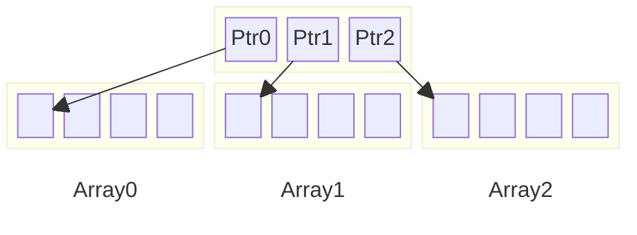

<script src="{{ '/assets/js/no_scroll_on_expand.js' | relative_url }}"></script>


This post is a follow up on my initial [post](/posts/memory_arena/) on memory arenas where I explore some design and implementation choices for containers build on top of arenas.

## Implementation rationale

For the implementation of memory arena backed containers, I decided to accept and follow some "properties" and "rules":

- The containers memory footprint will *mostly* only increase during their usage[^fn-only_grow_exceptions]:
	* this is mainly due to the fact that when the memory arena backing the container is shared by multiple containers or systems that allocate in it, the allocations get interleaved making harder to release memory back to the arena.
	<br/>However, the memory arena should contain allocations with the **same lifetime** so this is a "non-issue" in practice.
- Since deallocation happens at once, by either the releasing of the whole `MemoryArena` or via rewinding (`MemoryArena::rewind`), **destructors are not called**:
	* this implies that the types held by the containers must (should?) be **trivially destructible**.
- The containers *can* provide the option to "initialize" the objects by calling their constructor
	* this is a *convenience* feature
	* usually this implies that types stored in the containers must be *trivially constructible*
- For now, not all containers can be copied:
	* I am still unsure if I want to restrict the copy only between containers backed by the **same** arena
- For now, I do not intend to be compatible with the STL (iterator, for range, traits, etc.)

By following these rules/constraints, the implementation of memory arena backed containers is made easier (and shorter).

[^fn-only_grow_exceptions]: With some exceptions as we will see

## MemoryArenaVector

Dynamic size array similar to `std::vector` that is backed by a memory arena.

Below you can find most of the methods of the `MemoryArenaVector`'s interface

```cpp
template <typename T, bool BInitObjects = false>
class MemoryArenaVector
{
	public:
		bool reserve(U64 capacity);
		bool resize(U64 size);

		template <typename ...Args>
		bool emplace_back(Args && ...args);

		bool push_back(T const & x);
		bool push_back(T && x);

		bool pop_back(T & element);
		bool pop_back();

		// Reduce the array capacity to its length.
		// If the array is the last arena allocation, give the space back to the arena.
		bool shrink_to_fit();

		// Remove all the element from the array.
		// If the array is the last arena allocation, give the space back to the arena.
		void clear(bool bTryRewindArena = true);

		T & operator[](U64 i);
		T const & operator[](U64 i) const;

		T * data();
		T const * data() const;

		T * begin();
		T const * begin();
		T * end();
		T const * end();

		U64 size();
		U64 byteSize();
		U64 capacity() const;
};
```

* `reserve`: Pre-allocate 'freeSpace' elements at the back
* `emplace_back`: Construct an element inplace at the back
* `push_back`: Add an element at the back
* `pop_back`: Removes an element from the back
* `shrink_to_fit`: Reduce the array capacity to its length. If the array is the last arena allocation, give the space back to the arena.
* `clear`: Remove all the element from the array. If the array is the last arena allocation, give the space back to the arena.

<details>
<summary>Implementation (click to expand)</summary>


template <typename T, bool BInitObjects = false>
class MemoryArenaVector
{
	static_assert(IsTriviallyDestructible<T>::Value, "T must be trivially destructible to be used with MemoryArenaVector (no destructor called)");

	MemoryArena * m_arena; // Note: can never be nullptr (either points to a valid MemoryArena or to NullMemoryArena::sDummy)
	T * m_data;
	U64 m_length;
	U64 m_capacity;

	public:
		MemoryArenaVector():
			m_arena(&NullMemoryArena::sDummy),
			m_data(nullptr),
			m_length(0),
			m_capacity(0)
		{

		}

		explicit MemoryArenaVector(MemoryArena & a):
			m_arena(&a),
			m_data(nullptr),
			m_length(0),
			m_capacity(0)
		{
	
		}

		template <bool BInitObjects_>
		MemoryArenaVector(MemoryArenaVector<T, BInitObjects_> const & other):
			m_arena(other.m_arena)
		{
			copy_content(other);
		}

		template <bool BInitObjects_>
		MemoryArenaVector(MemoryArenaVector<T, BInitObjects_> && other):
			m_arena(other.m_arena),
			m_data(other.m_data),
			m_length(other.m_length),
			m_capacity(other.m_capacity)
		{
			other.m_arena = &NullMemoryArena::sDummy;
			other.m_data = nullptr;
			other.m_length = 0;
			other.m_capacity = 0;
		}

		// Note: the operator= does not copy the other arena but rather keeps its own
		// -> only the elements from the other MemoryArenaVector are copied over.
		template <bool BInitObjects_>
		MemoryArenaVector & operator=(MemoryArenaVector<T, BInitObjects_> const & other)
		{
			copy_content(other);
			return *this;
		}

		template <bool BInitObjects_>
		MemoryArenaVector & operator=(MemoryArenaVector<T, BInitObjects_> && other)
		{
			swap(other);
			return *this;
		}

		~MemoryArenaVector() = default;

		bool reserve(U64 capacity)
		{
			if(capacity <= m_capacity)
				return true;

			if(m_length == 0) // If no storage has been allocated yet, make an initial allocation
			{
				if(T * data = m_arena->allocateAs<T>(capacity * sizeof(T), alignof(T)))
				{
					m_data = data;
					m_capacity = capacity;
					m_length = 0;
					return true;
				}
				else
				{
					return false;
				}
			}
			else // Otherwise grow the storage
			{
				if(is_last_arena_allocation()) // If the array ends at the next arena allocation, extend it.
				{
					if(T * data = m_arena->allocateAs<T>((capacity - m_capacity) * sizeof(T), 1))
					{
						m_capacity = capacity;
						return true;
					}
					else
					{
						return false;
					}
				}
				else // Otherwise allocate a new array and copy
				{
					if(T * data = m_arena->allocateAs<T>(capacity * sizeof(T), alignof(T)))
					{
						if constexpr(BInitObjects)
						{
							for(U64 i = 0; i < m_length; ++i)
								data[i] = m_data[i];
						}
						else
						{
							Memcpy(data, m_data, m_length * sizeof(T));
						}
						m_data = data;
						m_capacity = capacity;
						return true;
					}
					else
					{
						return false;
					}
				}
			}
		}

		bool resize(U64 size)
		{
			if(size > m_capacity)
			{
				if(!reserve(size))
					return false;

				if constexpr(BInitObjects)
				{
					for(U64 i = m_length; i < size; ++i)
					{
						if constexpr(IsMemoryArenaAware<T>::Value)
							new(&m_data[i]) T{*m_arena};
						else
							new(&m_data[i]) T();
					}
				}
			}

			m_length = size;
			return true;
		}

		template <typename ...Args>
		bool emplace_back(Args && ...args)
		{
			if(m_length >= m_capacity)
			{
				if(!grow())
					return false;
			}

			const U64 idx = m_length++;

			if constexpr(IsMemoryArenaAware<T>::Value)
				new(&m_data[idx]) T{*m_arena, K_FWD(args)...};
			else
				new(&m_data[idx]) T(K_FWD(args)...);

			return true;
		}

		bool push_back(T const & x)
		{
			return emplace_back(x);
		}

		bool push_back(T && x)
		{
			return emplace_back(K_MOVE(x));
		}

		bool pop_back(T & element)
		{
			if(m_length > 0)
			{
				element = K_MOVE(m_data[m_length-1]);
				m_length -= 1;
				return true;
			}
			return false;
		}

		bool pop_back()
		{
			T x;
			return pop_back(x);
		}

		// Reduce the array capacity to its length.
		// If the array is the last arena allocation, give the space back to the arena.
		bool shrink_to_fit()
		{
			if(m_length < m_capacity)
			{
				if(is_last_arena_allocation())
				{
					void * mark = PtrUtils::Add(m_data, m_length);
					m_arena->rewind(mark);
				}

				m_capacity = m_length;
				return true;
			}
			return false;
		}

		// Remove all the element from the array.
		// If the array is the last arena allocation, give the space back to the arena.
		void clear(bool bTryRewindArena = true)
		{
			if(bTryRewindArena && is_last_arena_allocation())
				m_arena->rewind(m_data);

			m_data = nullptr;
			m_capacity = 0;
			m_length = 0;
		}

		T & operator[](U64 i)
		{
			K_ASSERT((U64)i < m_length);
			return m_data[i];
		}

		T const & operator[](U64 i) const
		{
			K_ASSERT((U64)i < m_length);
			return m_data[i];
		}

		T * data()
		{
			return m_data;
		}

		T const * data() const
		{
			return m_data;
		}

		T * begin()
		{
			return m_data;
		}

		T const * begin() const
		{
			return m_data;
		}

		T * end()
		{
			return m_data + m_length;
		}

		T const * end() const
		{
			return m_data + m_length;
		}
	
		U64 size() const
		{
			return m_length;
		}

		U64 byteSize() const
		{
			return m_length * sizeof(T);
		}

		U64 capacity() const
		{
			return m_capacity;
		}

		MemoryArena & arena()
		{
			return *m_arena;
		}

		MemoryArena const & arena() const
		{
			return *m_arena;
		}

		template <bool BInitObjects_>
		void swap(MemoryArenaVector<T, BInitObjects_> & other)
		{
			Swap(m_arena, other.m_arena);
			Swap(m_data, other.m_data);
			Swap(m_length, other.m_length);
			Swap(m_capacity, other.m_capacity);
		}

	private:
		bool is_last_arena_allocation() const
		{
			return m_data && (m_arena->ptr() == PtrUtils::Add(m_data, m_capacity * sizeof(T))); // Array ends at the next arena allocation
		}

		bool grow()
		{
			return reserve(m_data ? m_capacity * 2 : 2);
		}

		template <bool BInitObjects_>
		void copy_content(MemoryArenaVector<T, BInitObjects_> const & other)
		{
			clear();
			if(reserve(other.m_capacity))
			{
				if constexpr(BInitObjects)
				{
					for(U64 i = 0; i < other.m_length; ++i)
						m_data[i] = other.m_data[i];
				}
				else
				{
					Memcpy(m_data, other.m_data, other.m_length * sizeof(T));
				}
				m_length = other.m_length;
			}
		}
};


</details>

<br/>A nice [trick](https://nullprogram.com/blog/2023/10/05/) explained by Dennis Schön and Chris Wellon is that if we detect that the `MemoryArenaVector` storage is the last memory arena,
we can grow it without moving the current elements by just allocating a bit more from the memory arena and only updating the vector size (the data pointer stays the same).


After growth


Similarily, we can also shrink the vector and return memory to the arena with `MemoryArena::rewind`.


When used alone with a `VirtualMemoryArena` with a *huge* memory range, it can act like an "infinite" dynamic array (similar to the [`VMemArray`](https://github.com/jlaumon/AssetCooker/blob/main/src/VMemArray.h) described by Jeremy Laumon)

A drawback with the `MemoryArenaVector` is that, when it needs to grow, it wastes memory if any allocation happens after the initial `MemoryArenaVector` allocation within the same memory arena
and it does not keep pointers stability.


After growth


If there is the need to have a sequence of values that can be contiguously indexed but not necessarily contiguous in memory and that do not waste memory on growth, the `MemoryArenaDeque` is a better fit.


## MemoryArenaDeque

The `MemoryArenaDeque` is an indexed sequence container that allows fast insertion and deletion at both its beginning and its end similar to the [`std::deque`](https://en.cppreference.com/w/cpp/container/deque).

It is implemented as an array of pointers to fixed-size memory blocks backed a `MemoryArena`.



When the `MemoryArenaDeque` needs to grow a new block is allocated and added to the list of blocks.
Thus even if another allocation happened in the memory arena, it does not waste memory... Well this is not *exactly* true because the *array of pointers* needs to grow so is it reallocated and the old one is lost.
However, the waste should not be significant for "reasonnable" block size: I accept this extra memory as part of the `MemoryArenaDeque` memory footprint.


After growth


> Ignoring the case where we performed a pre-reservation (via `reserve_front`|`reserve_back`), after the 1st growth 1 pointer (8 bytes) is "lost", after the 2nd two more (3 = 24 bytes), after N growth we "lost" $$\frac{N(N+1)}{2}$$ pointers.
<br/>If the array sizes chosen for the `MemoryArenaDeque` or the type stored are big enough, the "waste" does not represent a significant amount.
{: .prompt-tip }

Below you can find most of the methods of the `MemoryArenaDeque`'s interface

```cpp
template <typename T, U64 TArraySize, bool BInitObjects = false>
class MemoryArenaDeque
{
	public:
		// Try to ensure we pre-allocated 'freeSpace' elements at the back
		bool reserve_back(U64 freeSpace);

		// Try to ensure we pre-allocated 'freeSpace' elements at the front
		bool reserve_front(U64 freeSpace);

		template <typename ...Args>
		bool emplace_back(Args && ...args);

		bool push_back(T const & x);
		bool push_back(T && x);

		template <typename ...Args>
		bool emplace_front(Args && ...args);

		bool push_front(T const & x);
		bool push_front(T && x);

		bool pop_back(T & x);
		bool pop_back();

		bool pop_front(T & x);
		bool pop_front();

		void clear();

		T & operator[](U64 i);
		T const & operator[](U64 i) const;

		U64 size() const;
		U64 array_size() const;
		U64 num_arrays() const;
		U64 capacity() const;
		U64 free_space_front() const;
		U64 free_space_back() const;

		// TFunc = void(*)(T * rangeStart, U64 rangeLength)
		template <typename TFunc>
		void foreach_range(TFunc && func);

		// TFunc = void(*)(T const * rangeStart, U64 rangeLength)
		template <typename TFunc>
		void foreach_range(TFunc && func) const;

		// Copy the content of the MemoryArenaDeque into the memory zone represented by the span.
		// Returns a span over the elements that have been copied over.
		Span<T> copy_to(Span<T> const & dst) const;
};
```

* `reserve_back`: Pre-allocate 'freeSpace' elements at the back
* `reserve_front`: Pre-allocate 'freeSpace' elements at the front
* `emplace_back`: Construct an element inplace at the back
* `push_back`: Add an element at the back
* `emplace_front`: Construct an element inplace at the front
* `push_front`: Add an element at the front
* `pop_back`: Removes an element from the back
* `pop_front`: Removes an element from the front
* `foreach_range`: Iterates over the continuous ranges of the deque (= arrays)

<details>
<summary>Implementation (click to expand)</summary>


#define K_MEMORY_ARENA_DEQUE_ENABLE_INVARIANTS_CHECK 0

#if K_MEMORY_ARENA_DEQUE_ENABLE_INVARIANTS_CHECK
#define K_MEMORY_ARENA_DEQUE_CHECK_INVARIANTS() K_ASSERT(check_invariants())
#else
#define K_MEMORY_ARENA_DEQUE_ENABLE_INVARIANTS_CHECK() K_NOOP()
#endif

// Note: the 'm_arrays' array containing pointers to the fixed-size arrays is not released to the arena when resized
// -> we accept this small overhead of memory usage to keep the implementation simple (the size of the array should be
// small for a reasonnable ArraySize)
// Inspired by: https://medium.com/@ryan_forrester_/how-deque-is-implemented-in-c-an-in-depth-look-703b601ace29
//
// No exceptions are thrown:
//  - if a constructor fails to allocate, the container stays empty
//  - if a method can fail, it returns a boolean
//
// Cannot shrink, can only be released at once
template <typename T, U64 TArraySize, bool BInitObjects = false>
class MemoryArenaDeque
{
	static_assert(IsTriviallyDestructible<T>::Value, "T must be trivially destructible to be used with MemoryArenaDeque (no destructor called)");

	MemoryArena * m_arena; // Note: can never be nullptr (either points to a valid MemoryArena or to NullMemoryArena::sDummy)

	// [ ptr ] [ ptr ] [ ptr ]  <-- Array of pointers to data blocks (called 'map')
	//    |       |       |
	//    v       v       v
	// [array] [array] [array]  <-- Data blocks containing 'ArraySize' elements
	T ** m_arrays;
	U64 m_numArrays;
	U64 m_beg;
	U64 m_end; // Points to one after last element
	U64 m_size;
	U64 m_frontArrayIdx;
	U64 m_backArrayIdx;

	public:
		using Type = T;
		static constexpr U64 ArraySize = TArraySize;

		MemoryArenaDeque():
			m_arena(&NullMemoryArena::sDummy),
			m_arrays(nullptr),
			m_numArrays(0),
			m_beg(0),
			m_end(0),
			m_size(0),
			m_frontArrayIdx(0),
			m_backArrayIdx(0)
		{

		}

		explicit MemoryArenaDeque(MemoryArena & arena):
			m_arena(&arena),
			m_arrays(nullptr),
			m_numArrays(0),
			m_beg(0),
			m_end(0),
			m_size(0),
			m_frontArrayIdx(0),
			m_backArrayIdx(0)
		{

		}

		MemoryArenaDeque(MemoryArenaDeque const & other) = delete;

		template <bool BInitObjects_>
		MemoryArenaDeque(MemoryArenaDeque<T, TArraySize, BInitObjects_> && other):
			m_arena(other.m_arena),
			m_arrays(other.m_arrays),
			m_numArrays(other.m_numArrays),
			m_beg(other.m_beg),
			m_end(other.m_end),
			m_size(other.m_size),
			m_frontArrayIdx(other.m_frontArrayIdx),
			m_backArrayIdx(other.m_backArrayIdx)
		{
			other.m_arena = &NullMemoryArena::sDummy;
			other.m_arrays = nullptr;
			other.m_numArrays = 0;
			other.m_beg = 0;
			other.m_end = 0;
			other.m_size = 0;
			other.m_frontArrayIdx = 0;
			other.m_backArrayIdx = 0;
		}

		MemoryArenaDeque & operator=(MemoryArenaDeque const & other) = delete;

		template <bool BInitObjects_>
		MemoryArenaDeque & operator=(MemoryArenaDeque<T, TArraySize, BInitObjects_> && other)
		{
			swap(other);
			return *this;
		}

		~MemoryArenaDeque() = default;

		// Try to ensure we pre-allocated 'freeSpace' elements at the back
		bool reserve_back(U64 freeSpace)
		{
			K_MEMORY_ARENA_DEQUE_CHECK_INVARIANTS();
			const U64 currFreeSpace = free_space_back();
			if(freeSpace <= currFreeSpace)
				return true;
			const bool bSuccess = grow_free_space(freeSpace, true);
			K_MEMORY_ARENA_DEQUE_CHECK_INVARIANTS();
			return bSuccess;
		}

		// Try to ensure we pre-allocated 'freeSpace' elements at the front
		bool reserve_front(U64 freeSpace)
		{
			K_MEMORY_ARENA_DEQUE_CHECK_INVARIANTS();
			const U64 currFreeSpace = free_space_front();
			if(freeSpace <= currFreeSpace)
				return true;
			const bool bSuccess = grow_free_space(freeSpace, false);
			K_MEMORY_ARENA_DEQUE_CHECK_INVARIANTS();
			return bSuccess;
		}

		template <typename ...Args>
		bool emplace_back(Args && ...args)
		{
			K_MEMORY_ARENA_DEQUE_CHECK_INVARIANTS();

			// If no storage has been allocated yet, make an initial allocation
			if(m_numArrays == 0)
			{
				if(!grow_free_space(ArraySize, true))
				{
					K_MEMORY_ARENA_DEQUE_CHECK_INVARIANTS();
					return false;
				}
				m_beg = 0;
				m_end = 0;
			}
			// If the current array is full, use the next one
			else if(m_end == ArraySize)
			{
				// If the current array is the last one, try to reserve one more
				if(m_backArrayIdx == m_numArrays-1)
				{
					if(!grow_free_space(ArraySize, true))
					{
						K_MEMORY_ARENA_DEQUE_CHECK_INVARIANTS();
						return false;
					}
				}
				K_ASSERT(m_backArrayIdx < m_numArrays);
				m_backArrayIdx += 1;
				m_end = 0;
			}

			K_ASSERT(m_end < ArraySize);
			new(&m_arrays[m_backArrayIdx][m_end]) T(K_FWD(args)...);
			m_end  += 1;
			m_size += 1;

			K_MEMORY_ARENA_DEQUE_CHECK_INVARIANTS();
			return true;
		}

		bool push_back(T const & x)
		{
			return emplace_back(x);
		}

		bool push_back(T && x)
		{
			return emplace_back(K_MOVE(x));
		}

		template <typename ...Args>
		bool emplace_front(Args && ...args)
		{
			K_MEMORY_ARENA_DEQUE_CHECK_INVARIANTS();

			// If no storage has been allocated yet, make an initial allocation
			if(m_numArrays == 0)
			{
				if(!grow_free_space(ArraySize, false))
				{
					K_MEMORY_ARENA_DEQUE_CHECK_INVARIANTS();
					return false;
				}
				m_beg = ArraySize;
				m_end = ArraySize;
			}
			// If the current array is full, use the previous one
			else if(m_beg == 0)
			{
				// If the current array is the first one, try to reserve one more
				if(m_frontArrayIdx == 0)
				{
					if(!grow_free_space(ArraySize, false))
					{
						K_MEMORY_ARENA_DEQUE_CHECK_INVARIANTS();
						return false;
					}
				}
				K_ASSERT(m_frontArrayIdx > 0);
				m_frontArrayIdx -= 1;
				m_beg = ArraySize;
			}
			K_ASSERT(m_beg > 0);
			m_beg  -= 1;
			new(&m_arrays[m_frontArrayIdx][m_beg]) T(K_FWD(args)...);
			m_size += 1;

			K_MEMORY_ARENA_DEQUE_CHECK_INVARIANTS();
			return true;
		}

		bool push_front(T const & x)
		{
			return emplace_front(x);
		}

		bool push_front(T && x)
		{
			return emplace_front(K_MOVE(x));
		}

		bool pop_back(T & x)
		{
			K_MEMORY_ARENA_DEQUE_CHECK_INVARIANTS();

			if(m_size == 0)
				return false;

			x = K_MOVE(m_arrays[m_backArrayIdx][m_end-1]);

			if(m_end == 1 && m_backArrayIdx > m_frontArrayIdx)
			{
				m_end = ArraySize;
				m_backArrayIdx -= 1;
			}
			else
			{
				m_end -= 1;
			}

			m_size -= 1;

			K_MEMORY_ARENA_DEQUE_CHECK_INVARIANTS();
			return true;
		}

		bool pop_back()
		{
			T x;
			return pop_back(x);
		}

		bool pop_front(T & x)
		{
			K_MEMORY_ARENA_DEQUE_CHECK_INVARIANTS();

			if(m_size == 0)
				return false;

			x = K_MOVE(m_arrays[m_frontArrayIdx][m_beg]);

			if(m_beg == ArraySize-1 && m_frontArrayIdx < m_backArrayIdx)
			{
				m_beg = 0;
				m_frontArrayIdx += 1;
			}
			else
			{
				K_ASSERT(m_beg != ArraySize-1 || m_size==1);
				m_beg += 1;
			}

			m_size -= 1;

			K_MEMORY_ARENA_DEQUE_CHECK_INVARIANTS();
			return true;
		}

		bool pop_front()
		{
			T x;
			return pop_front(x);
		}

		void clear()
		{
			K_MEMORY_ARENA_DEQUE_CHECK_INVARIANTS();
			m_beg = 0;
			m_end = 0;
			m_size = 0;
			m_frontArrayIdx = 0;
			m_backArrayIdx = 0;
			K_MEMORY_ARENA_DEQUE_CHECK_INVARIANTS();
		}

		T & operator[](U64 i)
		{
			const U64 arrayIdx    = (m_beg + i) / ArraySize;
			const U64 arrayOffset = (m_beg + i) % ArraySize;
			K_ASSERT(arrayIdx < m_numArrays);
			return m_arrays[m_frontArrayIdx + arrayIdx][arrayOffset];
		}

		T const & operator[](U64 i) const
		{
			const U64 arrayIdx    = (m_beg + i) / ArraySize;
			const U64 arrayOffset = (m_beg + i) % ArraySize;
			K_ASSERT(arrayIdx < m_numArrays);
			return m_arrays[m_frontArrayIdx + arrayIdx][arrayOffset];
		}

		U64 size() const
		{
			return m_size;
		}

		U64 array_size() const
		{
			return ArraySize;
		}

		U64 num_arrays() const
		{
			return m_numArrays;
		}

		U64 capacity() const
		{
			return m_numArrays * ArraySize;
		}

		U64 free_space_front() const
		{
			if(m_numArrays == 0)
				return 0;

			U64 freeSpace = m_frontArrayIdx * ArraySize;
			freeSpace += m_beg;
			return freeSpace;
		}

		U64 free_space_back() const
		{
			if(m_numArrays == 0)
				return 0;

			U64 freeSpace = (m_numArrays - 1 - m_backArrayIdx) * ArraySize;
			freeSpace += ArraySize - m_end;
			return freeSpace;
		}

		MemoryArena & arena()
		{
			return *m_arena;
		}

		MemoryArena const & arena() const
		{
			return *m_arena;
		}

		template <bool BInitObjects_>
		void swap(MemoryArenaDeque<T, TArraySize, BInitObjects_> & other)
		{
			K_MEMORY_ARENA_DEQUE_CHECK_INVARIANTS();
			Swap(m_arena, other.m_arena);
			Swap(m_arrays, other.m_arrays);
			Swap(m_numArrays, other.m_numArrays);
			Swap(m_beg, other.m_beg);
			Swap(m_end, other.m_end);
			Swap(m_size, other.m_size);
			Swap(m_frontArrayIdx, other.m_frontArrayIdx);
			Swap(m_backArrayIdx, other.m_backArrayIdx);
			K_MEMORY_ARENA_DEQUE_CHECK_INVARIANTS();
		}

		// TFunc = void(*)(T * rangeStart, U64 rangeLength)
		template <typename TFunc>
		void foreach_range(TFunc && func)
		{
			foreach_range_impl<T*>(func);
		}

		// TFunc = void(*)(T const * rangeStart, U64 rangeLength)
		template <typename TFunc>
		void foreach_range(TFunc && func) const
		{
			const_cast<MemoryArenaDeque &>(*this).foreach_range_impl<T const *>(func);
		}

		// Copy the content of the MemoryArenaDeque into the memory zone represented by the span.
		// Returns a span over the elements that have been copied over.
		Span<T> copy_to(Span<T> const & dst) const
		{
			if(dst.data == nullptr || dst.length == 0)
				return { nullptr, 0 };

			T * pDst = dst.data;
			U64 dstCopiedSize = 0;
			U64 dstRemainingSpace = dst.length;

			foreach_range([&](T const * rangeStart, U64 rangeLength)
			{
				const U64 sizeToCopy = rangeLength <= dstRemainingSpace ? rangeLength : dstRemainingSpace;
				if(sizeToCopy > 0)
				{
					Memcpy(pDst, rangeStart, sizeToCopy * sizeof(T));
					pDst += sizeToCopy;
					dstCopiedSize += sizeToCopy;
					dstRemainingSpace -= sizeToCopy;
				}
			});

			return { dst.data, dstCopiedSize };
		}

	private:
		bool check_invariants()
		{
			if(m_numArrays > 0)
			{
				// The actual number of used arrays must be lower or equal to the number of allocated ones
				K_ASSERT((m_backArrayIdx-m_frontArrayIdx+1) <= m_numArrays);
			}

			if(m_size == 0) // If the deque is empty
			{
				K_ASSERT(m_backArrayIdx == m_frontArrayIdx); // The front and back array must be the same
				K_ASSERT(m_end == m_beg); // The beg and end index must point to the same element
			}
			else
			{
				K_ASSERT((m_end >  0 && m_end <= ArraySize) || (m_end == 0 && m_numArrays > 1)); // m_end points to the element after the end with the back array
				K_ASSERT((m_beg >= 0 && m_beg <  ArraySize) || (m_beg == ArraySize && m_numArrays > 1)); // m_beg points to the first element in the front array
				K_ASSERT(m_backArrayIdx >= m_frontArrayIdx); // The back array is either the same or after the front array

				if(m_backArrayIdx != m_frontArrayIdx)
				{
					// (m_backArrayIdx-m_frontArrayIdx+1) * ArraySize --> capacity of the arrays that currently have at least 1 element
					// (ArraySize-m_end) --> number of free slots in back array
					// (ArraySize-(ArraySize-m_beg)) -> number of free slots in front array
					K_ASSERT(m_size == (m_backArrayIdx-m_frontArrayIdx+1)*ArraySize - (ArraySize-m_end) - (ArraySize-(ArraySize-m_beg)));
				}
				else
				{
					K_ASSERT(m_end > m_beg);
					K_ASSERT(m_size == (m_end - m_beg));
				}
			}

			return true;
		}

		bool grow_free_space(U64 freeSpace, bool bAtBack = true)
		{
			K_MEMORY_ARENA_DEQUE_CHECK_INVARIANTS();

			const U64 currFreeSpace = bAtBack ? free_space_back() : free_space_front();
			K_ASSERT(freeSpace > currFreeSpace);

			bool bSuccess = false;
			void * mark = m_arena->ptr();

			if(m_numArrays == 0) // If no storage has been allocated yet, make an initial allocation
			{
				const U64 newNumArrays = (freeSpace + ArraySize - 1) / ArraySize;
				if(T ** newArrays = m_arena->allocateElements<T*>(newNumArrays, MemoryArenaFlag::ZERO_MEMORY).data)
				{
					// Note: allocate separately from the 'array of pointers' since T can have a different alignment
					if(T * data = m_arena->allocateElements<T>(newNumArrays * ArraySize, MemoryArenaFlag::ZERO_MEMORY).data)
					{
						for(U64 i = 0; i < newNumArrays; ++i)
							newArrays[i] = data + i * ArraySize;
						m_arrays = newArrays;
						m_numArrays = newNumArrays;

						if(bAtBack)
						{
							m_frontArrayIdx = 0;
							m_beg = 0;
							m_backArrayIdx = 0;
							m_end = 0;
						}
						else
						{
							m_frontArrayIdx = newNumArrays-1;
							m_beg = ArraySize;
							m_backArrayIdx = newNumArrays-1;
							m_end = ArraySize;
						}

						bSuccess = true;
					}
					else
					{
						m_arena->rewind(mark);
						bSuccess = false;
					}
				}
				else
				{
					bSuccess = false;
				}
			}
			else // Otherwise grow the storage
			{
				// Allocate bigger array of 'pointers to fixed-sized arrays'
				const U64 currCapacity = capacity();
				const U64 newCapacity  = currCapacity + freeSpace - currFreeSpace;
				const U64 newNumArrays = (newCapacity + ArraySize - 1) / ArraySize;
				if(T ** newArrays = m_arena->allocateElements<T*>(newCapacity, MemoryArenaFlag::ZERO_MEMORY).data)
				{
					// Note: allocate separately from the 'array of pointers' since T can have a different alignment
					const U64 numArraysAdded = newNumArrays - m_numArrays;
					if(T * data = m_arena->allocateElements<T>(numArraysAdded * ArraySize, MemoryArenaFlag::ZERO_MEMORY).data)
					{
						// Copy over the previous array of 'pointers to fixed-sized arrays'
						const U64 prevOffset = bAtBack ? 0 : numArraysAdded;
						Memcpy(newArrays + prevOffset, m_arrays, m_numArrays * sizeof(T*));

						// Add new arrays
						const U64 newOffset = bAtBack ? m_numArrays : 0;
						for(U64 i = 0; i < numArraysAdded; ++i)
							newArrays[i + newOffset] = data + i * ArraySize;

						if(!bAtBack)
						{
							m_frontArrayIdx += numArraysAdded;
							m_backArrayIdx  += numArraysAdded;
						}

						m_arrays = newArrays;
						m_numArrays = newNumArrays;
						bSuccess = true;
					}
					else
					{
						m_arena->rewind(mark);
						bSuccess = false;
					}
				}
				else
				{
					bSuccess = false;
				}
			}

			K_MEMORY_ARENA_DEQUE_CHECK_INVARIANTS();

			return bSuccess;
		}

		template <typename TPtr, typename TFunc>
		void foreach_range_impl(TFunc && func)
		{
			K_MEMORY_ARENA_DEQUE_CHECK_INVARIANTS();

			if(m_size == 0)
				return;

			// Iterate over front array
			{
				const U64 frontArraySize = ArraySize - m_beg < m_size ? ArraySize - m_beg : m_size;
				TPtr rangeStart  = m_arrays[m_frontArrayIdx] + m_beg;
				U64 rangeLength = frontArraySize;
				func(rangeStart, rangeLength);
			}

			// Iterate over intermediate arrays
			if(m_backArrayIdx >= m_frontArrayIdx + 2)
			{
				for(U64 arrayIdx = m_frontArrayIdx + 1; arrayIdx < m_backArrayIdx; ++arrayIdx)
				{
					TPtr rangeStart  = m_arrays[arrayIdx];
					U64 rangeLength = ArraySize;
					func(rangeStart, rangeLength);
				}
			}

			// Iterate over back array
			if(m_backArrayIdx > m_frontArrayIdx)
			{
				TPtr rangeStart  = m_arrays[m_backArrayIdx];
				U64 rangeLength = m_end;
				func(rangeStart, rangeLength);
			}

			K_MEMORY_ARENA_DEQUE_CHECK_INVARIANTS();
		}

		template <typename T, U64 TArraySize, bool BInitObjects>
		friend bool SerializeBinary(BinarySerializationContext & ctx, MemoryArenaDeque<T, TArraySize, BInitObjects> & x);
};

</details>

<br/>
> The `MemoryArenaDeque` makes a great building block to implement various other data structures such as a **stack**, a **queue**, a **growable pool of objects**, a **resource handle manager** etc.
{: .prompt-tip }

### Stack

The `MemoryArenaDeque` can be used as a **stack** (*last in, first out*) by using either `push_back` + `pop_back` or `push_front` + `pop_front`:

```cpp
deque.push_back(0); // array = [0]
deque.push_back(1); // array = [0, 1]
deque.push_back(2); // array = [0, 1, 2]
deque.pop_back(x); // x = 2, array = [0, 1]
deque.pop_back(x); // x = 1, array = [0] 
deque.pop_back(x); // x = 0, array = []
```
or
```cpp
deque.push_front(0); // array = [0]
deque.push_front(1); // array = [1, 0]
deque.push_front(2); // array = [2, 1, 0]
deque.pop_front(x); // x = 2, array = [1, 0]
deque.pop_front(x); // x = 1, array = [0] 
deque.pop_front(x); // x = 0, array = []
```

> As a reminder: the `MemoryArenaDeque` does not release back memory to its backing arena.
<br/>All allocations of released at once when the arena is released or rewound.
{: .prompt-warning }

### Queue

The `MemoryArenaDeque` can be used as a **queue** (*first in, first out*) by using either `push_back` + `pop_front` or `push_front` + `pop_back`:

```cpp
deque.push_back(0); // array = [0]
deque.push_back(1); // array = [0, 1]
deque.push_back(2); // array = [0, 1, 2]
deque.pop_front(x); // x = 0, array = [1, 2]
deque.pop_front(x); // x = 1, array = [2] 
deque.pop_front(x); // x = 2, array = []
```
or
```cpp
deque.push_front(0); // array = [0]
deque.push_front(1); // array = [1, 0]
deque.push_front(2); // array = [2, 1, 0]
deque.pop_back(x); // x = 0, array = [2, 1]
deque.pop_back(x); // x = 1, array = [0] 
deque.pop_back(x); // x = 2, array = []
```

### MemoryArenaPool

The `MemoryArenaPool` represents a **growable pool of objects** backed by a memory arena.

Its relies on a `MemoryArenaDeque` with occupancy bitmasks to tracks valid/free entries.

```cpp
const U64 MemoryArenaPoolInvalidIndex = ~0ull;

template <typename T, U64 Granularity = 1024, bool BInitObjects = false>
class MemoryArenaPool
{
	static_assert(IsTriviallyDestructible<T>::Value, "T must be trivially destructible to be used with MemoryArenaPool (no destructor called)");

	static constexpr U64 ChunkSize = 64 * 8; // 512
	static_assert(Granularity % ChunkSize == 0);

	struct Chunk
	{
		T items[ChunkSize]; // Note: multiple of 64 bytes (= multiple of cache line size)
		U64 occupancy[8];   // Note: size = 64 bytes = 1 cache line
	};

	MemoryArenaDeque<Chunk, Granularity/ChunkSize, BInitObjects> m_chunks;
	U64 m_size;

	public:
		MemoryArenaPool():
			m_chunks(),
			m_size(0)
		{

		}

		explicit MemoryArenaPool(MemoryArena & arena):
			m_chunks(arena),
			m_size(0)
		{

		}

		MemoryArenaPool(MemoryArenaPool const & other) = delete;

		template <bool BInitObjects_>
		MemoryArenaPool(MemoryArenaPool<T, Granularity, BInitObjects_> && other):
			m_chunks(K_MOVE(other.m_chunks)),
			m_size(other.m_size)
		{
			other.m_size = 0;
		}

		MemoryArenaPool & operator=(MemoryArenaPool const & other) = delete;

		template <bool BInitObjects_>
		MemoryArenaPool & operator=(MemoryArenaPool<T, Granularity, BInitObjects_> && other)
		{
			swap(other);
			return *this;
		}

		~MemoryArenaPool() = default;

		template <typename ...Args>
		U64 emplace(Args && ...args)
		{
			U64 idx = 0;
			for(U64 chunkIdx = 0; chunkIdx < m_chunks.size(); ++chunkIdx)
			{
				Chunk & chunk = m_chunks[chunkIdx];
				for(U64 subChunkIdx = 0; subChunkIdx < 8; ++subChunkIdx)
				{
					if(chunk.occupancy[subChunkIdx] != ~0ull) // If not full
					{
						const U64 bitIdx = BitScanLSB(~chunk.occupancy[subChunkIdx]);
						new(&chunk.items[subChunkIdx * 64 + bitIdx]) T{K_FWD(args)...};
						chunk.occupancy[subChunkIdx] |= (1ull << bitIdx);
						idx += bitIdx;
						m_size += 1;
						return idx;
					}
					idx += 64;
				}
			}

			// Note: the MemoryArenaDeque entries are zero-initialized
			if(!m_chunks.emplace_back())
			{
				return MemoryArenaPoolInvalidIndex;
			}

			Chunk & chunk = m_chunks[m_chunks.size()-1];
			new(&chunk.items[0]) T{K_FWD(args)...};
			chunk.occupancy[0] |= (1ull << 0);
			m_size += 1;

			return m_size-1;
		}

		U64 push(T const & x)
		{
			return emplace(x);
		}

		U64 push(T && x)
		{
			return emplace(K_MOVE(x));
		}

		bool remove(U64 idx)
		{
			const U64 chunkIdx = idx / ChunkSize;
			if(chunkIdx < m_chunks.size())
			{
				const U64 itemIdxInChunk = idx % ChunkSize;
				const U64 subChunkIdx = itemIdxInChunk >> 6; // itemIdxInChunk / 64;
				const U64 bitIdx      = itemIdxInChunk & 63; // itemIdxInChunk % 64;

				Chunk & chunk = m_chunks[chunkIdx];
				if(chunk.occupancy[subChunkIdx] & (1ull << bitIdx))
				{
					chunk.occupancy[subChunkIdx] &= ~(1ull << bitIdx);  // Clear occupancy bit
					Memset(&chunk.items[itemIdxInChunk], 0, sizeof(T)); // Clear item to 0 to ensure consistent serialization
					m_size -= 1;
					return true;
				}
			}
			return false;
		}

		void clear()
		{
			for(U64 chunkIdx = 0; chunkIdx < m_chunks.size(); ++chunkIdx)
			{
				Chunk & chunk = m_chunks[chunkIdx];
				for(U64 subChunkIdx = 0; subChunkIdx < 8; ++subChunkIdx)
				{
					if(chunk.occupancy[subChunkIdx] != 0)
					{
						Memset(chunk.items, 0, sizeof(chunk.items));
						chunk.occupancy[subChunkIdx] = 0;
					}
				}
			}
			m_size = 0;
		}

		bool valid(U64 idx) const
		{
			const U64 chunkIdx = idx / ChunkSize;
			if(chunkIdx < m_chunks.size())
			{
				const U64 itemIdxInChunk = idx % ChunkSize;
				const U64 subChunkIdx = itemIdxInChunk >> 6; // itemIdxInChunk / 64;
				const U64 bitIdx      = itemIdxInChunk & 63; // itemIdxInChunk % 64;

				Chunk const & chunk = m_chunks[chunkIdx];
				return (chunk.occupancy[subChunkIdx] & (1ull << bitIdx));
			}
			return false;
		}

		T * get(U64 idx)
		{
			return valid(idx) ? &m_chunks[idx / ChunkSize].items[idx % ChunkSize] : nullptr;
		}

		T const * get(U64 idx) const
		{
			return valid(idx) ? &m_chunks[idx / ChunkSize].items[idx % ChunkSize] : nullptr;
		}

		T & operator[](U64 idx)
		{
			return m_chunks[idx / ChunkSize].items[idx % ChunkSize];
		}

		T const & operator[](U64 idx) const
		{
			return m_chunks[idx / ChunkSize].items[idx % ChunkSize];
		}

		U64 size() const
		{
			return m_size;
		}

		U64 capacity() const
		{
			return m_chunks.size() * ChunkSize;
		}

		MemoryArena & arena()
		{
			return m_chunks.arena();
		}

		MemoryArena const & arena() const
		{
			return m_chunks.arena();
		}

		template <bool BInitObjects_>
		void swap(MemoryArenaPool<T, Granularity, BInitObjects_> & other)
		{
			m_chunks.swap(other.m_chunks);
			Swap(m_size, other.m_size);
		}

		// Iterate over valid items
		// TFunc = void(*)(T & item, U64 idx)
		template <typename TFunc>
		void foreach(TFunc && func)
		{
			foreach_impl<T&>(func);
		}

		// Iterate over valid items
		// TFunc = void(*)(T const & item, U64 idx)
		template <typename TFunc>
		void foreach(TFunc && func) const
		{
			const_cast<MemoryArenaPool &>(*this).foreach_impl<T const &>(func);
		}

		// Iterate over the chunks of the pool (can contain both valid and invalid items)
		// TFunc = void(*)(T * rangeStart, U64 rangeLength)
		template <typename TFunc>
		void foreach_chunk(TFunc && func)
		{
			foreach_chunk_impl<T*>(func);
		}

		// Iterate over the chunks of the pool (can contain both valid and invalid items)
		// TFunc = void(*)(T copst * rangeStart, U64 rangeLength)
		template <typename TFunc>
		void foreach_chunk(TFunc && func) const
		{
			const_cast<MemoryArenaPool &>(*this).foreach_chunk_impl<T const *>(func);
		}

	private:
		template <typename TRef, typename TFunc>
		void foreach_impl(TFunc && func)
		{
			for(U64 chunkIdx = 0; chunkIdx < m_chunks.size(); ++chunkIdx)
			{
				Chunk & chunk = m_chunks[chunkIdx];
				for(U64 subChunkIdx = 0; subChunkIdx < 8; ++subChunkIdx)
				{
					const U64 baseItemIdxInChunk = subChunkIdx * 64;
					U64 occupancy = chunk.occupancy[subChunkIdx];
					while(occupancy != 0)
					{
						const U64 bitIdx = BitScanLSB(occupancy);
						const U64 itemIdxInChunk = baseItemIdxInChunk + bitIdx;
						const U64 globalItemIdx = chunkIdx * ChunkSize + itemIdxInChunk;
						TRef item = chunk.items[itemIdxInChunk];
						func(item, globalItemIdx);
						occupancy &= ~(1ull << bitIdx);
					}
				}
			}
		}

		template <typename TPtr, typename TFunc>
		void foreach_chunk_impl(TFunc && func)
		{
			for(U64 chunkIdx = 0; chunkIdx < m_chunks.size(); ++chunkIdx)
			{
				TPtr rangeStart = m_chunks[chunkIdx].items;
				func(rangeStart, ChunkSize);
			}
		}

		template <typename T, U64 Granularity, bool BInitObjects>
		friend bool SerializeBinary(BinarySerializationContext & ctx, MemoryArenaPool<T, Granularity, BInitObjects> & x);
};
```

<details>
<summary>Example (click to expand)</summary>



VirtualMemoryArena memoryArena;
memoryArena.init(64ull * 1024ull * 1024ull * 1024ull);

struct Foo
{
	U64 i;
	float f;

	Foo(): i(0), f(0) { }
	Foo(U64 ii, float ff): i(ii), f(ff) { }
};

MemoryArenaPool<Foo> pool(memoryArena);

// Insert items
for(U64 i = 0; i < 1024; ++i)
{
	const U64 idx = pool.emplace(i * 2, float(i) * 2.f + 1.f);
	K_ASSERT(idx == i);
	const Foo * item = pool.get(i);
	K_ASSERT(item != nullptr);
	K_ASSERT(item->i == i * 2);
	K_ASSERT(item->f == float(i) * 2.f + 1.f);
}
K_ASSERT(pool.size() == 1024);
K_ASSERT(pool.capacity() == 1024);

// Check inserted items via get
for(U64 i = 0; i < 1024; ++i)
{
	const Foo * item = pool.get(i);
	K_ASSERT(item != nullptr);
	K_ASSERT(item->i == i * 2);
	K_ASSERT(item->f == float(i) * 2.f + 1.f);
}

// Check inserted items via []
for(U64 i = 0; i < 1024; ++i)
{
	const Foo & item = pool[i];
	K_ASSERT(item.i == i * 2);
	K_ASSERT(item.f == float(i) * 2.f + 1.f);
}

// Check valid
for(U64 i = 0; i < 1024; ++i)
{
	const bool b = pool.valid(i);
	K_ASSERT(b);
}

// Remove every other item
for(U64 i = 0; i < 1024; i += 2)
{
	const bool b = pool.remove(i);
	K_ASSERT(b);
}
K_ASSERT(pool.size() == 512);
K_ASSERT(pool.capacity() == 1024);

// Check not valid
for(U64 i = 0; i < 1024; i += 2)
{
	const bool b = pool.valid(i);
	K_ASSERT(!b);
}

// Check valid
for(U64 i = 1; i < 1024; i += 2)
{
	const bool b = pool.valid(i);
	K_ASSERT(b);
}

// foreach
{
	U64 idx = 1;
	pool.foreach([&idx](Foo const & foo, U64 itemIdx)
	{
		K_ASSERT(foo.i == idx * 2);
		K_ASSERT(foo.f == float(idx) * 2.f + 1.f);
		K_ASSERT(itemIdx == idx);
		idx += 2;
	});
}

// emplace after removal -> check reuse
{
	for(U64 i = 0; i < 512; ++i)
	{
		const U64 idx = pool.emplace(5 + i * 2, 6.f + float(i) * 2.f + 1.f);
		K_ASSERT(idx == i * 2);
		const Foo * item = pool.get(idx);
		K_ASSERT(item != nullptr);
		K_ASSERT(item->i == 5 + i * 2);
		K_ASSERT(item->f == 6.f + float(i) * 2.f + 1.f);
	}
	K_ASSERT(pool.size() == 1024);
	K_ASSERT(pool.capacity() == 1024);
}


</details>


### ResourceHandleManager

The **resource handle manager** (or **handle-based resource pool**) is a system that manages a collection of objects using [**generational indices**](https://floooh.github.io/2018/06/17/handles-vs-pointers.html).
<br/>It assigns lightweight **handles** to objects rather than exposing direct pointers, improving safety and control over resource lifetimes:

- objects are accessed via handles (`{index, generation}`), preventing dangling references when objects are deleted
- each object slot has a generation counter that increments when an object is removed and replaced, invalidating old handles
- freed slots can be reused with the generation number used to prevent stale access

This kind of system is commonly used in game engines, ECS architectures, and resource management systems where safe and efficient object pooling is needed.

By combining a pair of `MemoryArenaDeque` with a [free-list](https://en.wikipedia.org/wiki/Free_list) and generational handles, we can implement a **growable resource handle manager backed by a memory arena** with a few lines of code:

```cpp
template <typename Tag, typename TType, size_t TNumBitsIndex>
class TResourceHandle
{
	public:
		using Type = TType;

	private:
		static constexpr Type TotalNumBits      = 8 * sizeof(Type);
		static constexpr Type NumBitsIndex      = TNumBitsIndex;
		static constexpr Type NumBitsInFreelist = 1;
		static constexpr Type NumBitsGeneration = TotalNumBits - NumBitsIndex - NumBitsInFreelist;
		static constexpr Type MaxIndex          = (Type(1) << NumBitsIndex) - 1;
		static constexpr Type MaxGeneration     = (Type(1) << NumBitsGeneration) - 1;

		Type index : NumBitsIndex;
		Type inFreelist : NumBitsInFreelist;
		Type generation : NumBitsGeneration;

		template <typename T, typename TResourceHandle, size_t Granularity>
		friend class ResourceHandleManager;

	public:
		TResourceHandle(): index(0), inFreelist(0), generation(0) { }

		bool operator==(TResourceHandle const & other) const
		{
			return (index == other.index) && (generation == other.generation);
		}

		bool operator!=(TResourceHandle const & other) const
		{
			return (index != other.index) || (generation != other.generation);
		}

		Type getIndex() const { return index; }

		bool isNull() const { return index == 0 && generation == 0; }
};

template <typename Tag>
using ResourceHandle32 = TResourceHandle<Tag, U32, 16>;

template <typename Tag>
using ResourceHandle64 = TResourceHandle<Tag, U64, 32>;

// Note: handle indices start at 1 (0 means invalid)
template <typename T, typename TResourceHandle, size_t Granularity = 128>
class ResourceHandleManager
{
	public:
		using Handle = TResourceHandle;

	private:
		using HandleContainer   = MemoryArenaDeque<Handle, Granularity>;
		using ResourceContainer = MemoryArenaDeque<T, Granularity>;
		HandleContainer m_handles;
		ResourceContainer m_resources;
		Handle m_freelistHead;

	public:
		ResourceHandleManager() = default;

		void init(MemoryArena & memoryArena)
		{
			m_handles = HandleContainer{memoryArena};
			m_resources = ResourceContainer{memoryArena};
		}

		bool reserve(size_t numResources)
		{
			return m_handles.reserve_back(numResources) && m_resources.reserve_back(numResources);
		}

		template <typename ...Args>
		Handle createResource(Args && ...args)
		{
			// First try to reuse a slot from the freelist
			if(m_freelistHead.index != 0)
			{
				// Remove an entry from the freelist
				Handle::Type index = m_freelistHead.index;
				Handle & handle = m_handles[index-1];
				m_freelistHead.index = handle.index;

				// Initialize it
				handle.index = index;
				handle.inFreelist = 0;
				new(&m_resources[index-1]) T{K_FWD(args)...};

				return handle;
			}

			// If we could not find a free slot, allocate a new one
			if(m_handles.emplace_back())
			{
				if(m_resources.emplace_back(K_FWD(args)...))
				{
					const Handle::Type n = numeric_cast<Handle::Type>(m_handles.size());
					Handle & handle = m_handles[n-1];
					handle.index = n;
					handle.inFreelist = 0;
					handle.generation = 0;
					return handle;
				}
				m_handles.pop_back();
			}

			return Handle{ };
		}

		bool isValidHandle(Handle const & h) const
		{
			if(h.index != 0 && h.index <= m_handles.size())
			{
				if(h.generation == m_handles[h.index-1].generation)
					return true;
			}
			return false;
		}

		T * getResource(Handle const & h)
		{
			if(h.index != 0 && h.index <= m_handles.size())
			{
				if(h.generation == m_handles[h.index-1].generation)
					return &m_resources[h.index-1];
			}
			return nullptr;
		}

		T const * getResource(Handle const & h) const
		{
			if(h.index != 0 && h.index <= m_handles.size())
			{
				if(h.generation == m_handles[h.index-1].generation)
					return &m_resources[h.index-1];
			}
			return nullptr;
		}

		void destroyResource(Handle const & h)
		{
			if(h.index != 0 && h.index <= m_handles.size())
			{
				// Increase generation index to invalidate existing handles
				// and add the slot to the freelist, except if we reached the max generation,
				// in which case we disable the slot by not putting it in the freelist.
				Handle & handle = m_handles[h.index-1];
				if(handle.generation < Handle::MaxGeneration)
				{
					handle.generation += 1;
					if(handle.generation != Handle::MaxGeneration)
					{
						// Prepend to freelist (use Handle::index to store next free slot)
						handle.index = m_freelistHead.index;
						handle.inFreelist = 1;
						m_freelistHead.index = h.index;
					}
				}
			}
		}

		template <typename TFunc>
		void foreach(TFunc && func)
		{
			for(size_t i = 0; i < m_resources.size(); ++i)
			{
				Handle const & handle = m_handles[i];
				if(!handle.inFreelist && handle.generation < Handle::MaxGeneration)
				{
					func(handle, m_resources[i]);
				}
			}
		}

		template <typename TFunc>
		void foreach(TFunc && func) const
		{
			for(size_t i = 0; i < m_resources.size(); ++i)
			{
				Handle const & handle = m_handles[i];
				if(!handle.inFreelist && handle.generation < Handle::MaxGeneration)
				{
					func(handle, m_resources[i]);
				}
			}
		}

		void clear()
		{
			m_handles.clear();
			m_resources.clear();
			m_freelistHead = { };
		}
};
```

> A single `MemoryAreneDeque` could have been used by packing the **handle** with the **resource**. However this might lead to extra padding for every elements due to alignment.
{: .prompt-tip }

Example usage:

```cpp
struct Foo
{
	int i;
	float f;

	Foo(): i(0), f(0) { }
	Foo(int ii, float ff): i(ii), f(ff) { }
};

VirtualMemoryArena memoryArena;
memoryArena.init(64ull * 1024ull * 1024ull * 1024ull);

using FooHandle = ResourceHandle32<Foo>;
ResourceHandleManager<Foo, FooHandle> handleMgr;
handleMgr.init(memoryArena);

FooHandle h0 = handleMgr.createResource();
FooHandle h1 = handleMgr.createResource(5, 8.f);
	
Foo * f0 = handleMgr.getResource(h0);
K_ASSERT(f0 != nullptr);

Foo * f1 = handleMgr.getResource(h1);
K_ASSERT(f1 != nullptr);

handleMgr.destroyResource(h0);
f0 = handleMgr.getResource(h0);
K_ASSERT(f0 == nullptr);

FooHandle h2 = handleMgr.createResource(6, 9.f); // Reuse slot 0
Foo * f2 = handleMgr.getResource(h2);
K_ASSERT(f2 != nullptr);
```

## Laying the foundation: what's next?

I probably will not dive deeper into the rabbit-hole of containers because the ones presented here are already quite versatile and cover a lot of my practical use cases (although I might revisit their interfaces if need be).

In this post we explored mostly "array-like" containers, however there is stiil a second type of containers that I want to use with arenas: **hashmaps**[^fn-arrays_and_hashmaps]!
<br/>But that's for another time, thanks for reading!

[^fn-arrays_and_hashmaps]: All we need are arrays and hashmaps, right?


## References

* **Untangling Lifetimes: The Arena Allocator**: <https://www.rfleury.com/p/untangling-lifetimes-the-arena-allocator>
* **Arena allocator tips and tricks**: <https://nullprogram.com/blog/2023/09/27/>
* **A simple, arena-backed, generic dynamic array for C**: <https://nullprogram.com/blog/2023/10/05/>
* **Handles are the better pointers**: <https://floooh.github.io/2018/06/17/handles-vs-pointers.html>

## Footnotes
