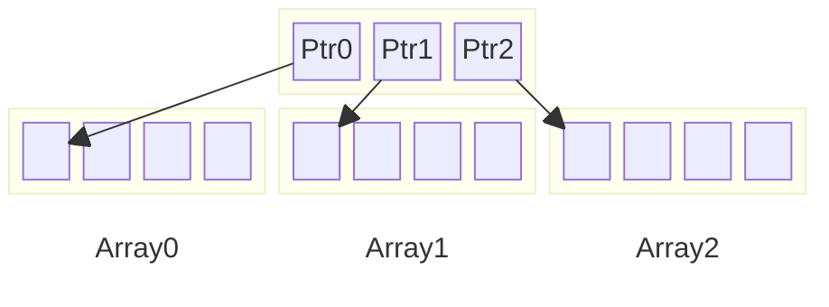

This post is a follow up on my initial post on memory arenas.

> TODO link to previous post
{: .prompt-danger }


## Misc

For the implementation of MemoryArena-backed containers, I decided to follow some "rules":

- The containers directly backed by a `MemoryArena` cannot shrink without "wasting" memory[^fn-cannot_shrink]:
	* this is mostly true when the memory arena backing the container is shared by multiple containers or systems that allocate in it
	<br/>the allocations get interleaved making harder to reclaim memory BUT the memory arena contains allocations with the same lifetime so this is a "non-issue" in practice.
- Since deallocation happens at once, by either the releasing of the whole `MemoryArena` or via rewinding (`MemoryArena::rewind`), **no destructor are called**:
	* the types held by the containers must be **trivially destructible**.
- The containers *can* provide the option to "initialize" the objects by calling their constructor
	* this is a *convenience* feature
	* usually this implies that types stored in the containers must be *trivially constructible*

By following these rules/constraints, the implementation of MemoryArena-backed containers is made easier (and shorter).

[^fn-cannot_shrink]: With some exceptions as we will see

## MemoryArenaVector

Dynamic size array similar to `std::vector` that is backed by a memory arena.

> TODO show interface
{: .prompt-danger }

A nice [trick](https://nullprogram.com/blog/2023/10/05/) explained by Dennis Schön and Chris Wellon is that if we detect that the `MemoryArenaVector` storage is the last memory arena,
we can grow it without moving the current elements by just allocating a bit more from the memory arena and only updating the vector size (the data pointer stays the same).


After growth


Similarily, we can also shrink the vector and return memory to the arena with `MemoryArena::rewind`.


> TODO code snippet
{: .prompt-danger }

> TODO gist
{: .prompt-danger }

When used alone with a `VirtualMemoryArena` with a *huge* memory range, it can act like an "infinite" dynamic array (similar to the [`VMemArray`](https://github.com/jlaumon/AssetCooker/blob/main/src/VMemArray.h) described by Jeremy Laumon)

A drawback with the `MemoryArenaVector` is that, when it needs to grow, it wastes memory if any allocation happens after the initial `MemoryArenaVector` allocation within the same memory arena
and it does not keep pointers stability.


After growth


If there is the need to have a sequence of values that can be contiguously indexed but not necessarily contiguous in memory and that do not waste memory on growth, the `MemoryArenaDeque` is a better fit.


## MemoryArenaDeque

The `MemoryArenaDeque` is an indexed sequence container that allows fast insertion and deletion at both its beginning and its end similar to the [`std::deque`](https://en.cppreference.com/w/cpp/container/deque).

It is implemented as an array of pointers to fixed-size memory blocks backed a `MemoryArena`.



When the `MemoryArenaDeque` needs to grow a new block is allocated and added to the list of blocks.
Thus even if another allocation happened in the memory arena, it does not waste memory... Well this is not *exactly* true because the *array of pointers* needs to grow so is it reallocated and the old one is lost.
However, the waste should not be significant for "reasonnable" block size: I accept this extra memory as part of the `MemoryArenaDeque` memory footprint.


After growth


> Ignoring the case where we performed a pre-reservation (via `reserve_front`|`reserve_back`), after the 1st growth one 1 pointer (8 bytes) is "lost", after the 2nd two more (3 = 24 bytes), after N growth we "lost" $$\frac{N(N+1)}{2}$$ pointers.
<br/>If the array sizes chosen for the `MemoryArenaDeque` or the type stored are big enough, the "waste" does not represent a significant amount.
{: .prompt-tip }

> TODO show interface
{: .prompt-danger }

> TODO gist
{: .prompt-danger }

It can be used to implement a **stack**, a **queue**, a **growable pool of objects**, a **resource handle manager** etc.

### Stack

The `MemoryArenaDeque` can be used as a **stack** (*last in, first out*) by using either `push_back` + `pop_back` or `push_front` + `pop_front`:

```cpp
deque.push_back(0); // array = [0]
deque.push_back(1); // array = [0, 1]
deque.push_back(2); // array = [0, 1, 2]
deque.pop_back(x); // x = 2, array = [0, 1]
deque.pop_back(x); // x = 1, array = [0] 
deque.pop_back(x); // x = 0, array = []
```
or
```cpp
deque.push_front(0); // array = [0]
deque.push_front(1); // array = [1, 0]
deque.push_front(2); // array = [2, 1, 0]
deque.pop_front(x); // x = 2, array = [1, 0]
deque.pop_front(x); // x = 1, array = [0] 
deque.pop_front(x); // x = 0, array = []
```

> As a reminder: the `MemoryArenaDeque` does not release back memory to its backing arena.
<br/>All allocations of released at once when the arena is released or rewound.
{: .prompt-warning }

### Queue

The `MemoryArenaDeque` can be used as a **queue** (*first in, first out*) by using either `push_back` + `pop_front` or `push_front` + `pop_back`:

```cpp
deque.push_back(0); // array = [0]
deque.push_back(1); // array = [0, 1]
deque.push_back(2); // array = [0, 1, 2]
deque.pop_front(x); // x = 0, array = [1, 2]
deque.pop_front(x); // x = 1, array = [2] 
deque.pop_front(x); // x = 2, array = []
```
or
```cpp
deque.push_front(0); // array = [0]
deque.push_front(1); // array = [1, 0]
deque.push_front(2); // array = [2, 1, 0]
deque.pop_back(x); // x = 0, array = [2, 1]
deque.pop_back(x); // x = 1, array = [0] 
deque.pop_back(x); // x = 2, array = []
```

### MemoryArenaPool

The `MemoryArenaPool` represents a **growable pool of objects** backed by a memory arena.

Its relies on a `MemoryArenaDeque` with occupancy bitmasks to tracks valid/free entries.

```cpp
const U64 MemoryArenaPoolInvalidIndex = ~0ull;

template <typename T, U64 Granularity = 1024>
class MemoryArenaPool
{
	static constexpr U64 ChunkSize = 64 * 8; // 512
	static_assert(Granularity % ChunkSize == 0);

	struct Chunk
	{
		T items[ChunkSize]; // Note: multiple of 64 bytes (= multiple of cache line size)
		U64 occupancy[8];   // Note: size = 64 bytes = 1 cache line
	};

	MemoryArenaDeque<Chunk, Granularity/ChunkSize> m_chunks;
	U64 m_size;

	public:
		MemoryArenaPool():
			m_chunks(),
			m_size(0)
		{

		}

		explicit MemoryArenaPool(MemoryArena & arena):
			m_chunks(arena),
			m_size(0)
		{

		}

		MemoryArenaPool(MemoryArenaPool const & other) = delete;

		MemoryArenaPool(MemoryArenaPool && other):
			m_chunks(K_MOVE(other.m_chunks)),
			m_size(other.m_size)
		{
			other.m_size = 0;
		}

		MemoryArenaPool & operator=(MemoryArenaPool const & other) = delete;

		MemoryArenaPool & operator=(MemoryArenaPool && other)
		{
			swap(other);
			return *this;
		}

		~MemoryArenaPool() = default;

		template <typename ...Args>
		U64 emplace(Args && ...args)
		{
			U64 idx = 0;
			for(U64 chunkIdx = 0; chunkIdx < m_chunks.size(); ++chunkIdx)
			{
				Chunk & chunk = m_chunks[chunkIdx];
				for(U64 subChunkIdx = 0; subChunkIdx < 8; ++subChunkIdx)
				{
					if(chunk.occupancy[subChunkIdx] != ~0ull) // If not full
					{
						const U64 bitIdx = BitScanLSB(~chunk.occupancy[subChunkIdx]);
						new(&chunk.items[subChunkIdx * 64 + bitIdx]) T{K_FWD(args)...};
						chunk.occupancy[subChunkIdx] |= (1ull << bitIdx);
						idx += bitIdx;
						m_size += 1;
						return idx;
					}
					idx += 64;
				}
			}

			// Note: the MemoryArenaDeque entries are zero-initialized
			if(!m_chunks.emplace_back())
			{
				return MemoryArenaPoolInvalidIndex;
			}

			Chunk & chunk = m_chunks[m_chunks.size()-1];
			new(&chunk.items[0]) T{K_FWD(args)...};
			chunk.occupancy[0] |= (1ull << 0);
			m_size += 1;

			return m_size-1;
		}

		U64 push(T const & x)
		{
			return emplace(x);
		}

		U64 push(T && x)
		{
			return emplace(K_MOVE(x));
		}

		bool remove(U64 idx)
		{
			const U64 chunkIdx = idx / ChunkSize;
			if(chunkIdx < m_chunks.size())
			{
				const U64 itemIdxInChunk = idx % ChunkSize;
				const U64 subChunkIdx = itemIdxInChunk >> 6; // itemIdxInChunk / 64;
				const U64 bitIdx      = itemIdxInChunk & 63; // itemIdxInChunk % 64;

				Chunk & chunk = m_chunks[chunkIdx];
				if(chunk.occupancy[subChunkIdx] & (1ull << bitIdx))
				{
					chunk.occupancy[subChunkIdx] &= ~(1ull << bitIdx);  // Clear occupancy bit
					Memset(&chunk.items[itemIdxInChunk], 0, sizeof(T)); // Clear item to 0 to ensure consistent serialization
					m_size -= 1;
					return true;
				}
			}
			return false;
		}

		void clear()
		{
			for(U64 chunkIdx = 0; chunkIdx < m_chunks.size(); ++chunkIdx)
			{
				Chunk & chunk = m_chunks[chunkIdx];
				for(U64 subChunkIdx = 0; subChunkIdx < 8; ++subChunkIdx)
				{
					if(chunk.occupancy[subChunkIdx] != 0)
					{
						Memset(chunk.items, 0, sizeof(chunk.items));
						chunk.occupancy[subChunkIdx] = 0;
					}
				}
			}
			m_size = 0;
		}

		bool valid(U64 idx) const
		{
			const U64 chunkIdx = idx / ChunkSize;
			if(chunkIdx < m_chunks.size())
			{
				const U64 itemIdxInChunk = idx % ChunkSize;
				const U64 subChunkIdx = itemIdxInChunk >> 6; // itemIdxInChunk / 64;
				const U64 bitIdx      = itemIdxInChunk & 63; // itemIdxInChunk % 64;

				Chunk const & chunk = m_chunks[chunkIdx];
				return (chunk.occupancy[subChunkIdx] & (1ull << bitIdx));
			}
			return false;
		}

		T * get(U64 idx)
		{
			return valid(idx) ? &m_chunks[idx / ChunkSize].items[idx % ChunkSize] : nullptr;
		}

		T const * get(U64 idx) const
		{
			return valid(idx) ? &m_chunks[idx / ChunkSize].items[idx % ChunkSize] : nullptr;
		}

		T & operator[](U64 idx)
		{
			return m_chunks[idx / ChunkSize].items[idx % ChunkSize];
		}

		T const & operator[](U64 idx) const
		{
			return m_chunks[idx / ChunkSize].items[idx % ChunkSize];
		}

		U64 size() const
		{
			return m_size;
		}

		U64 capacity() const
		{
			return m_chunks.size() * ChunkSize;
		}

		MemoryArena & arena()
		{
			return m_chunks.arena();
		}

		MemoryArena const & arena() const
		{
			return m_chunks.arena();
		}

		void swap(MemoryArenaPool & other)
		{
			m_chunks.swap(other.m_chunks);
			Swap(m_size, other.m_size);
		}

		// Iterate over valid items
		// TFunc = void(*)(T & item, U64 idx)
		template <typename TFunc>
		void foreach(TFunc && func)
		{
			foreach_impl<T&>(func);
		}

		// Iterate over valid items
		// TFunc = void(*)(T const & item, U64 idx)
		template <typename TFunc>
		void foreach(TFunc && func) const
		{
			const_cast<MemoryArenaPool &>(*this).foreach_impl<T const &>(func);
		}

		// Iterate over the chunks of the pool (can contain both valid and invalid items)
		// TFunc = void(*)(T * rangeStart, U64 rangeLength)
		template <typename TFunc>
		void foreach_chunk(TFunc && func)
		{
			foreach_chunk_impl<T*>(func);
		}

		// Iterate over the chunks of the pool (can contain both valid and invalid items)
		// TFunc = void(*)(T copst * rangeStart, U64 rangeLength)
		template <typename TFunc>
		void foreach_chunk(TFunc && func) const
		{
			const_cast<MemoryArenaPool &>(*this).foreach_chunk_impl<T const *>(func);
		}

	private:
		template <typename TRef, typename TFunc>
		void foreach_impl(TFunc && func)
		{
			for(U64 chunkIdx = 0; chunkIdx < m_chunks.size(); ++chunkIdx)
			{
				Chunk & chunk = m_chunks[chunkIdx];
				for(U64 subChunkIdx = 0; subChunkIdx < 8; ++subChunkIdx)
				{
					U64 baseItemIdxInChunk = subChunkIdx * 64;
					U64 occupancy = chunk.occupancy[subChunkIdx];
					while(occupancy != 0)
					{
						const U64 bitIdx = BitScanLSB(occupancy);
						const U64 itemIdxInChunk = baseItemIdxInChunk + bitIdx;
						const U64 globalItemIdx = chunkIdx * ChunkSize + itemIdxInChunk;
						TRef item = chunk.items[itemIdxInChunk];
						func(item, globalItemIdx);
						occupancy &= ~(1ull << bitIdx);
					}
				}
			}
		}

		template <typename TPtr, typename TFunc>
		void foreach_chunk_impl(TFunc && func)
		{
			for(U64 chunkIdx = 0; chunkIdx < m_chunks.size(); ++chunkIdx)
			{
				TPtr rangeStart = m_chunks[chunkIdx].items;
				func(rangeStart, ChunkSize);
			}
		}
};
```

> TODO example
{: .prompt-danger }


### ResourceHandleManager

The **resource handle manager** (or **handle-based resource pool**) is a system that manages a collection of objects using [**generational indices**](https://floooh.github.io/2018/06/17/handles-vs-pointers.html).
<br/>It assigns lightweight **handles** to objects rather than exposing direct pointers, improving safety and control over resource lifetimes:

- objects are accessed via handles (`{index, generation}`), preventing dangling references when objects are deleted
- each object slot has a generation counter that increments when an object is removed and replaced, invalidating old handles
- freed slots can be reused with the generation number used to prevent stale access

This kind of system is commonly used in game engines, ECS architectures, and resource management systems where safe and efficient object pooling is needed.

By combining a pair of `MemoryArenaDeque` with a [free-list](https://en.wikipedia.org/wiki/Free_list) and generational handles, we can implement a **growable resource handle manager backed by a memory arena** with a few lines of code:

```cpp
template <typename Tag, typename TType, size_t TNumBitsIndex>
class TResourceHandle
{
	public:
		using Type = TType;

	private:
		static constexpr Type TotalNumBits      = 8 * sizeof(Type);
		static constexpr Type NumBitsIndex      = TNumBitsIndex;
		static constexpr Type NumBitsInFreelist = 1;
		static constexpr Type NumBitsGeneration = TotalNumBits - NumBitsIndex - NumBitsInFreelist;
		static constexpr Type MaxIndex          = (Type(1) << NumBitsIndex) - 1;
		static constexpr Type MaxGeneration     = (Type(1) << NumBitsGeneration) - 1;

		Type index : NumBitsIndex;
		Type inFreelist : NumBitsInFreelist;
		Type generation : NumBitsGeneration;

		template <typename T, typename TResourceHandle, size_t Granularity>
		friend class ResourceHandleManager;

	public:
		TResourceHandle(): index(0), inFreelist(0), generation(0) { }

		bool operator==(TResourceHandle const & other) const
		{
			return (index == other.index) && (generation == other.generation);
		}

		bool operator!=(TResourceHandle const & other) const
		{
			return (index != other.index) || (generation != other.generation);
		}

		Type getIndex() const { return index; }

		bool isNull() const { return index == 0 && generation == 0; }
};

template <typename Tag>
using ResourceHandle32 = TResourceHandle<Tag, U32, 16>;

template <typename Tag>
using ResourceHandle64 = TResourceHandle<Tag, U64, 32>;

// Note: handle indices start at 1 (0 means invalid)
template <typename T, typename TResourceHandle, size_t Granularity = 128>
class ResourceHandleManager
{
	public:
		using Handle = TResourceHandle;

	private:
		using HandleContainer   = MemoryArenaDeque<Handle, Granularity>;
		using ResourceContainer = MemoryArenaDeque<T, Granularity>;
		HandleContainer m_handles;
		ResourceContainer m_resources;
		Handle m_freelistHead;

	public:
		ResourceHandleManager() = default;

		void init(MemoryArena & memoryArena)
		{
			m_handles = HandleContainer{memoryArena};
			m_resources = ResourceContainer{memoryArena};
		}

		bool reserve(size_t numResources)
		{
			return m_handles.reserve_back(numResources) && m_resources.reserve_back(numResources);
		}

		template <typename ...Args>
		Handle createResource(Args && ...args)
		{
			// First try to reuse a slot from the freelist
			if(m_freelistHead.index != 0)
			{
				// Remove an entry from the freelist
				Handle::Type index = m_freelistHead.index;
				Handle & handle = m_handles[index-1];
				m_freelistHead.index = handle.index;

				// Initialize it
				handle.index = index;
				handle.inFreelist = 0;
				new(&m_resources[index-1]) T{K_FWD(args)...};

				return handle;
			}

			// If we could not find a free slot, allocate a new one
			if(m_handles.emplace_back())
			{
				if(m_resources.emplace_back(K_FWD(args)...))
				{
					const Handle::Type n = numeric_cast<Handle::Type>(m_handles.size());
					Handle & handle = m_handles[n-1];
					handle.index = n;
					handle.inFreelist = 0;
					handle.generation = 0;
					return handle;
				}
				m_handles.pop_back();
			}

			return Handle{ };
		}

		bool isValidHandle(Handle const & h) const
		{
			if(h.index != 0 && h.index <= m_handles.size())
			{
				if(h.generation == m_handles[h.index-1].generation)
					return true;
			}
			return false;
		}

		T * getResource(Handle const & h)
		{
			if(h.index != 0 && h.index <= m_handles.size())
			{
				if(h.generation == m_handles[h.index-1].generation)
					return &m_resources[h.index-1];
			}
			return nullptr;
		}

		T const * getResource(Handle const & h) const
		{
			if(h.index != 0 && h.index <= m_handles.size())
			{
				if(h.generation == m_handles[h.index-1].generation)
					return &m_resources[h.index-1];
			}
			return nullptr;
		}

		void destroyResource(Handle const & h)
		{
			if(h.index != 0 && h.index <= m_handles.size())
			{
				// Increase generation index to invalidate existing handles
				// and add the slot to the freelist, except if we reached the max generation,
				// in which case we disable the slot by not putting it in the freelist.
				Handle & handle = m_handles[h.index-1];
				if(handle.generation < Handle::MaxGeneration)
				{
					handle.generation += 1;
					if(handle.generation != Handle::MaxGeneration)
					{
						// Prepend to freelist (use Handle::index to store next free slot)
						handle.index = m_freelistHead.index;
						handle.inFreelist = 1;
						m_freelistHead.index = h.index;
					}
				}
			}
		}

		template <typename TFunc>
		void foreach(TFunc && func)
		{
			for(size_t i = 0; i < m_resources.size(); ++i)
			{
				Handle const & handle = m_handles[i];
				if(!handle.inFreelist && handle.generation < Handle::MaxGeneration)
				{
					func(handle, m_resources[i]);
				}
			}
		}

		template <typename TFunc>
		void foreach(TFunc && func) const
		{
			for(size_t i = 0; i < m_resources.size(); ++i)
			{
				Handle const & handle = m_handles[i];
				if(!handle.inFreelist && handle.generation < Handle::MaxGeneration)
				{
					func(handle, m_resources[i]);
				}
			}
		}

		void clear()
		{
			m_handles.clear();
			m_resources.clear();
			m_freelistHead = { };
		}
};
```

> A single `MemoryAreneDeque` could have been used by packing the **handle** with the **resource**. However this might lead to extra padding for every elements due to alignment.
{: .prompt-tip }

Example usage:

```cpp
struct Foo
{
	int i;
	float f;

	Foo(): i(0), f(0) { }
	Foo(int ii, float ff): i(ii), f(ff) { }
};

VirtualMemoryArena memoryArena;
memoryArena.init(64ull * 1024ull * 1024ull * 1024ull);

using FooHandle = ResourceHandle32<Foo>;
ResourceHandleManager<Foo, FooHandle> handleMgr;
handleMgr.init(memoryArena);

FooHandle h0 = handleMgr.createResource();
FooHandle h1 = handleMgr.createResource(5, 8.f);
	
Foo * f0 = handleMgr.getResource(h0);
K_ASSERT(f0 != nullptr);

Foo * f1 = handleMgr.getResource(h1);
K_ASSERT(f1 != nullptr);

handleMgr.destroyResource(h0);
f0 = handleMgr.getResource(h0);
K_ASSERT(f0 == nullptr);

FooHandle h2 = handleMgr.createResource(6, 9.f); // Reuse slot 0
Foo * f2 = handleMgr.getResource(h2);
K_ASSERT(f2 != nullptr);
```

## Laying the foundation: what's next?

In this post we mostly explored some "array-like" containers.
<br/>I did not (and probably will not) dive too deep into the rabbit-hole of containers because the containers presented here are already quite versatile and cover a lot of my practical use cases.
<br/>There is still however a second type of containers that I want to use with arenas: hashmaps[^fn-arrays_and_hashmaps]!

[^fn-arrays_and_hashmaps]: All we need are arrays and hashmaps, right?

But that's it for now, thanks for reading!


## References

* **Untangling Lifetimes: The Arena Allocator**: <https://www.rfleury.com/p/untangling-lifetimes-the-arena-allocator>
* **Arena allocator tips and tricks**: <https://nullprogram.com/blog/2023/09/27/>
* **A simple, arena-backed, generic dynamic array for C**: <https://nullprogram.com/blog/2023/10/05/>
* **Handles are the better pointers**: <https://floooh.github.io/2018/06/17/handles-vs-pointers.html>

## Footnotes
