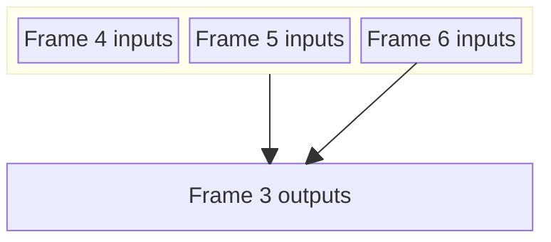

Several threading modes:
 * `SingleThread`: update then render on the same thread
 * `SynchronizedMainAndRenderThreads`: main produces frame N input data while render thread treats frame N-1 input data to produce frame N-1 output.
 * `UnsynchronizedMainThread`: the main thread produces frame input data at its own pace that the render thread consume at its own pace.

## `SingleThread` mode

Simplest mode, first generate frame input data then render to produce output frame data.

##  `SynchronizedMainAndRenderThreads` mode

This mode requires double-buffering of input and output data.

##  `UnsynchronizedMainThread` mode

Allows to input update and UI rendering at "full" speed even if the renderer is really slow.

This mode requires triple-buffering of input and output data.

The main thread grabs a free slot within the triple-buffer: the slot that is not use by the render thread and that it did not produce the previous frame.

The render thread can miss some input data produced by the main thread.
The main thread consumes all frames produced by the render thread.
If the main thread stops producing, the render thread has at most 2 frame inputs worth of data.

Triple-buffering is necessary for data produces by the main and consumed by the render thread.

> Double-buffering might enough for data produced by the render thread and consumed by the main thread since it is the main thread-produced inputs that drives the processing of the render thread and the production of output frames.
{: .prompt-warning}

With double-buffering, if the render thread catches up to the main thread, it has to wait for the main thread to consume the last produced frame output.
With triple-buffering, the render thread can start producing the next frame output (if the main had produced enough inputs).

> TODO compare to the different present modes.
{: .prompt-danger}